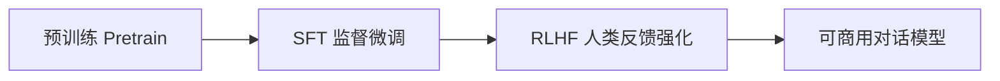

# Day 15 课堂讲义 · NLP 简史、Transformer 与 Token 成本

> **旁白**：老板问多少钱，你得先讲清楚 **钱算什么**——Token。上午建立大模型世界观；下午拿起 tiktoken 当算盘。

---

## 第一章 · NLP 四代演进（09:00–09:45）

### 1.1 时间线

| 时代 | 代表 | 核心思想 | 局限 |
|------|------|----------|------|
| 规则时代 | ELIZA、专家系统 | 人工编写规则 | 脆弱、难维护 |
| 统计时代 | TF-IDF、HMM、CRF | 从数据学概率 | 特征工程重 |
| 神经网络 | Word2Vec、LSTM | 分布式表示 | 长距离依赖难 |
| 预训练大模型 | Transformer、GPT | 规模 + 自监督 | 贵、需对齐 |

**业务对应**：星火智服不会从零训练模型，但 **懂演进** 才能选对 API 与 RAG 方案。

### 1.2 从「词袋」到「向量」

```text
词袋：  "退款"出现2次, "工单"出现1次  → 稀疏向量
Word2Vec: "退款" ≈ 近义词向量空间中靠近 "退货"
Transformer: 上下文动态表示 —— 同词在不同句中向量不同
```

▶ 运行：`python3 tiktoken_demo.py` 第一节，观察同一汉字在不同句中的切分。

---

## 第二章 · Transformer 类比（09:45–10:30）

### 2.1 不用公式理解注意力

把 Transformer 想成 **会议室里的专家合议**：

| 组件 | 类比 | 作用 |
|------|------|------|
| Token | 发言句里的每个词 | 输入单元 |
| Self-Attention | 每位专家听完全场再表态 | 词与词建立关联 |
| Multi-Head | 多角度分组讨论 | 捕获不同关系 |
| FFN | 个人消化整理 | 非线性变换 |
| 堆叠 N 层 | 多轮合议 | 抽象层次加深 |

```text
用户问：「我的工单 #8821 退款到哪了？」

Attention 让「退款」强烈关注「工单 #8821」
而不是去关联无关的「天气」类 Token
```

### 2.2 编码器 vs 解码器

| 架构 | 代表 | 典型用途 |
|------|------|----------|
| 仅编码器 | BERT | 分类、检索、Embedding |
| 仅解码器 | GPT 系列 | 文本生成、对话 |
| 编码器-解码器 | T5、BART | 翻译、摘要 |

星火智服对话 API 多为 **解码器生成式**：给定 messages，预测下一个 Token。

---

## 第三章 · 预训练、SFT、RLHF（10:30–11:00）

### 3.1 三阶段



| 阶段 | 数据 | 目标 | 比喻 |
|------|------|------|------|
| 预训练 | 海量网页、书籍 | 学语言与常识 | 通识教育 |
| SFT | 指令-回答对 | 学会按指令回答 | 岗位培训 |
| RLHF | 人类排序偏好 | 回答更安全、有用 | 质检与奖惩 |

### 3.2 与 API 的关系

你调用的 `gpt-4o-mini`、`deepseek-chat` 已是三阶段之后的 **对齐模型**。  
应用层主要做：提示词工程、RAG、工具调用—— **不重训底座**。

---

## 第四章 · Token 与 tiktoken（11:00–12:00）

### 4.1 什么是 Token

- API 按 **Token** 计费，不是按字符或按次。  
- 英文常 1 词 ≈ 1 Token；中文常 1 字 ≈ 1–2 Token（视编码而定）。  
- 同一段中文，换模型可能 Token 数不同。

```python
# tiktoken_demo.py 核心逻辑
import tiktoken

enc = tiktoken.encoding_for_model("gpt-4o-mini")
tokens = enc.encode("星火智服智能客服系统")
print(len(tokens))  # Token 数
print(enc.decode(tokens[:3]))  # 前 3 个 Token 还原
```

### 4.2 BPE 直觉

**Byte Pair Encoding**：从字符开始，高频相邻符号合并为新符号，形成词表。  
`tiktoken` 是 OpenAI 系模型分词的工具；DeepSeek 等兼容 API 可能有独立词表，课堂以 **gpt-4o** encoding 为基准估算。

### 4.3 messages 累计

```python
messages = [
    {"role": "system", "content": "你是星火智服客服助手。"},
    {"role": "user", "content": "如何申请退款？"},
]
# 成本估算 = 系统提示 + 历史轮次 + 用户最新输入 + 预期输出
```

▶ 运行：`python3 tiktoken_demo.py --section messages`

---

## 第五章 · 模型格局（14:00–14:45）

### 5.1 2026 常见选型

| 梯队 | 代表 | 特点 | 星火智服场景 |
|------|------|------|--------------|
| 国际商用 | GPT-4o 系列 | 生态成熟、工具链全 | 高质量客服、复杂推理 |
| 国际商用 | Claude 3.5 | 长上下文、写作强 | 长工单分析 |
| 国产 API | DeepSeek、通义、文心 | 合规、性价比 | 主力对话、摘要 |
| 开源可部署 | Qwen、Llama | 私有化 | 内网合规场景 |

### 5.2 选型维度

1. **价格**：输入/输出单价 × 预估 Token  
2. **上下文窗口**：RAG 片段能塞多少  
3. **延迟**：客服实时性  
4. **合规**：数据是否出境  

▶ 自测：`model_landscape_quiz.md`

---

## 第六章 · API 成本估算实操（14:45–17:00）

### 6.1 商务公式

```text
月费 ≈ 日均请求 × 30 × (输入Token×输入单价 + 输出Token×输出单价)
```

### 6.2 运行估算器

```bash
cd day15/code
python3 token_cost_estimator.py \
  --scenario data/xinghuo_proposal.txt \
  --daily-requests 500 \
  --output-tokens 300 \
  --tiers low,medium,high
```

输出示例字段：

```json
{
  "scenario_file": "xinghuo_proposal.txt",
  "input_tokens": 1240,
  "assumptions": { "daily_requests": 500, "output_tokens": 300 },
  "models": [
    { "model": "gpt-4o-mini", "monthly_cost_usd": 12.42 }
  ]
}
```

### 6.3 与小陈对齐的话术

> 「按中型场景日均 500 次、每次输入约 1200 Token、输出 300 Token，  
> gpt-4o-mini 月费约 XX 美元；DeepSeek 约 YY 美元。  
> 试点可先按低档 200 次估算。」

### 6.4 衔接 Day 13 客户端（可选 live）

```bash
# 配置 OPENAI_API_KEY 后
python3 token_cost_estimator.py --scenario data/xinghuo_proposal.txt --live-sample
```

`llm_compat.get_llm_client()` 返回 Day 13 弹性客户端，对比 `usage` 与 tiktoken。

---

## 第七章 · 今日小结

| 你必须带走 | 验收方式 |
|------------|----------|
| Transformer ≈ 注意力合议 | 能画简图 |
| 预训练 → SFT → RLHF | 口述各阶段数据 |
| Token ≠ 字 | tiktoken_demo 实测 |
| 成本 = Token × 单价 × 次数 | JSON 报告交付小陈 |

```bash
python3 verify_day15.py
```

---

**延伸阅读**：[08_补充讲义.md](./08_补充讲义.md) · BPE 细节与国产计价
