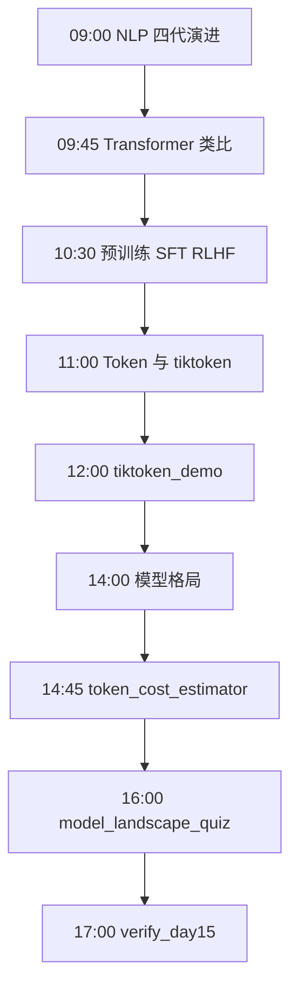
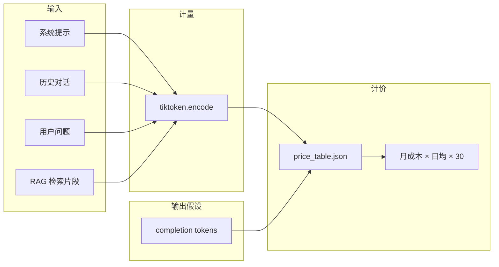

# Day 15 流程图与示意图

## 1. 一日学习流程



## 2. Transformer 解码一步

```text
已有 Token:  [你] [好] [，] [请]
                │
                ▼
        ┌───────────────┐
        │ Self-Attention │  每个位置「看向」全文
        └───────┬───────┘
                ▼
        ┌───────────────┐
        │ 预测下一 Token │  概率最高可能是「问」
        └───────┬───────┘
                ▼
        采样/贪心 → 输出「问」→ 继续自回归
```

## 3. 训练三阶段数据流

```text
  互联网文本                指令数据                 人类排序
      │                        │                        │
      ▼                        ▼                        ▼
┌───────────┐           ┌───────────┐           ┌───────────┐
│  预训练    │           │   SFT     │           │   RLHF    │
│ 下一词预测 │──────────▶│ 模仿标准答 │──────────▶│ 偏好奖励   │
└───────────┘           └───────────┘           └───────────┘
      │                        │                        │
      └────────────────────────┴────────────────────────┘
                               ▼
                    商用 API 模型（你只调接口）
```

## 4. Token 计价管道



## 5. 与 Day 12–14 衔接

```text
Day12 llm_client.chat()
        │ 返回 prompt_tokens / completion_tokens
        ▼
Day13 ResilientLLMClient（retry + timeout）
        │
        ▼
Day15 token_cost_estimator --live-sample
        │ 对比 API usage vs tiktoken 预估
        ▼
Day16 调参后 Token 数可能变化（输出长短）
```

## 6. 中英文 Token 差异示意

```text
英文: "Hello, SparkTech support"     → 约 5–6 tokens
中文: "你好，星火智服客服"            → 约 8–12 tokens（视编码）
混合: "星火智服 SparkTech FAQ"       → 分别按子词切分

结论：立项书不能按「字数」估算，必须 tiktoken 或 API usage
```

## 7. 成本三档矩阵

```text
              │ 低(200/日) │ 中(500/日) │ 高(2000/日)
──────────────┼────────────┼────────────┼────────────
gpt-4o-mini   │    $A      │    $B      │    $C
deepseek-chat │    $D      │    $E      │    $F
```

数值由 `token_cost_estimator.py` 自动生成填入 JSON。

---

**实操入口**：`cd day15/code && python3 token_cost_estimator.py`
