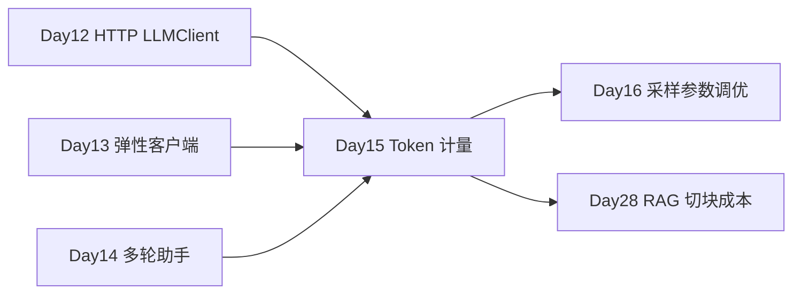

# Day 15 · NLP 简史 · Transformer 类比 · Token 与成本估算

> **旁白（讲师口吻）**  
> 周一上午，产品部小陈拿着《星火智服二期立项书》草稿冲进培训室：*「老板问：每月 API 要花多少钱？按什么模型报价？你们技术能不能先给 **Token 用量和成本区间**？」*  
> 张工在白板上画了一条时间线：*「从词袋模型到 Transformer，从预训练到 RLHF——上午讲清 **大模型怎么来的**；下午用 **tiktoken** 数 Token、算账单。无 API Key 照样 mock 跑通。」*  
> 今天是 **Week 3 理论 + 计量日**：为 Day 16 调参、Day 28 RAG 切块成本打地基。

---

## 今日学习地图

| 时段 | 主题 | 产出物 |
|------|------|--------|
| 09:00–10:30 | NLP 简史、Transformer 类比、预训练/SFT/RLHF | `04_课堂讲义.md` 第一～三章 |
| 10:30–12:00 | Token 概念、tiktoken、模型格局 | `tiktoken_demo.py` |
| 14:00–15:30 | API 成本估算公式与商务报价 | `token_cost_estimator.py` |
| 15:30–17:00 | 模型选型测验 + 星火智服方案演算 | `model_landscape_quiz.md` |
| 19:00–21:00 | 作业 + Git commit | `homework/day15/` |

## 与前后课程的衔接



| 前序能力 | 今日升级 |
|----------|----------|
| Day 12/13 `ChatResponse.usage` | 理解 prompt/completion tokens 字段含义 |
| Day 14 多轮 `messages` | 为 Token 累计与成本叠加铺垫 |
| Day 11 文件 IO | 读取方案文档、输出 JSON 报价单 |

## 今日文件清单

| 文件 | 用途 |
|------|------|
| [01_业务背景.md](./01_业务背景.md) | 星火智服二期立项 Token 成本需求 |
| [02_需求文档.md](./02_需求文档.md) | `token_cost_estimator` PRD |
| [03_架构与设计.md](./03_架构与设计.md) | 分词器、计价模块、数据流 |
| [04_课堂讲义.md](./04_课堂讲义.md) | **主课**（NLP 史 + Token + 成本） |
| [05_流程图与示意图.md](./05_流程图与示意图.md) | Transformer、训练阶段、计价流程图 |
| [06_课后作业.md](./06_课后作业.md) | 必做 / 选做 / 挑战 |
| [07_作业参考答案.md](./07_作业参考答案.md) | 参考答案与讲评要点 |
| [08_补充讲义.md](./08_补充讲义.md) | BPE、多模态 Token、国产模型计价 |
| [code/tiktoken_demo.py](./code/tiktoken_demo.py) | tiktoken 分词与计数演示 |
| [code/token_cost_estimator.py](./code/token_cost_estimator.py) | **商务报价 CLI** |
| [code/model_landscape_quiz.md](./code/model_landscape_quiz.md) | 模型格局自测题 |
| [code/llm_compat.py](./code/llm_compat.py) | 衔接 Day 12–14 客户端 |
| [code/verify_day15.py](./code/verify_day15.py) | 自动化验收 |
| [code/requirements.txt](./code/requirements.txt) | 依赖清单 |
| [code/.env.example](./code/.env.example) | 环境变量模板 |

## 今日验收标准

- [ ] 能口述 NLP 四代演进与 Transformer「注意力」类比  
- [ ] 能区分预训练、SFT、RLHF 三阶段目标  
- [ ] 能解释 Token 与字符/词的区别，以及为何 API 按 Token 计费  
- [ ] `python3 tiktoken_demo.py` 输出中英文样例的 Token 数  
- [ ] `python3 token_cost_estimator.py` 生成星火智服方案成本 JSON  
- [ ] 无 `OPENAI_API_KEY` 时 mock 模式全绿  
- [ ] `python3 verify_day15.py` 全部 `[OK]`  
- [ ] Git 已提交，commit message 含 `day15`

## 快速开始

```bash
cd day15/code
pip install -r requirements.txt
cp .env.example .env               # 可选：填入真实 Key 测 live 模式

python3 tiktoken_demo.py
python3 token_cost_estimator.py --scenario data/xinghuo_proposal.txt
python3 verify_day15.py
```

---

**讲师提醒**：小陈要的不是精确到分，而是 **可辩护的数量级**——输入多少 Token、输出假设多少、按 gpt-4o-mini 与 DeepSeek 各报一档。先 tiktoken 实测，再 `chars÷4` 交叉验证。

**状态**：✅ Day 15 完整课件已发布
