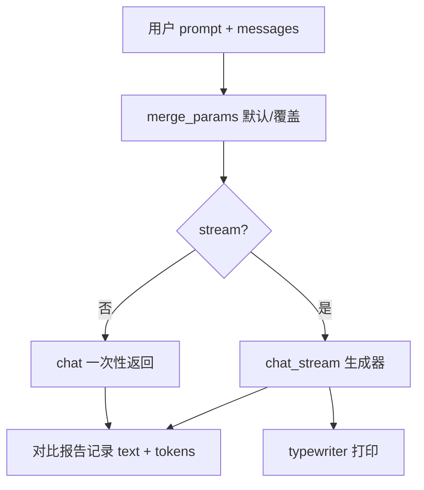

# Day 16 架构与设计 · 参数化客户端与流式管道

## 1. 总体架构

```text
┌─────────────────────────────────────────────────────────────────────┐
│  role_messages_demo   stream_demo   param_experiment   compare_params │
└────────────────────────────┬────────────────────────────────────────┘
                             │
                             ▼
┌─────────────────────────────────────────────────────────────────────┐
│              ParametricLLMClient (llm_compat.py)                      │
│   chat() ──────────────▶ Day13 ResilientLLMClient._live/_mock_chat      │
│   chat_stream() ─────▶ live: SSE chunk 解析 | mock: 逐字生成器        │
│   merge_params() ────▶ 默认 demo_defaults + 调用方覆盖                  │
└────────────────────────────┬────────────────────────────────────────┘
                             │
              ┌──────────────┴──────────────┐
              ▼                             ▼
┌──────────────────────────┐   ┌──────────────────────────────────────┐
│  data/demo_prompts.json  │   │  data/param_presets.json              │
│  data/param_presets.json │   │  output/compare_report_*.json         │
└──────────────────────────┘   └──────────────────────────────────────┘
```

## 2. 采样参数数据流



## 3. 参数语义（设计约束）

| 参数 | 范围 | 作用 | 演示建议 |
|------|------|------|----------|
| temperature | 0–2 | 随机性强度 | 0.2–0.5 客服 |
| top_p | 0–1 | 核采样累积概率 | 0.85–0.95 |
| max_tokens | 1–模型上限 | 输出 Token 上限 | 256–512 |
| frequency_penalty | -2–2 | 抑制重复已出现 token | 0.2–0.5 减套话 |

**temperature 与 top_p**：一般 **只调一个**，避免过度随机；课堂实验可故意双高展示失控。

## 4. 角色消息结构

```text
messages = [
  {"role": "system",    "content": "人设 + 边界 + 格式"},
  {"role": "user",      "content": "..."},
  {"role": "assistant", "content": "..."},  # 多轮历史
  {"role": "user",      "content": "最新问题"},
]
```

| role | 是否计入历史 | 典型内容 |
|------|--------------|----------|
| system | 会话级一次 | 品牌口吻、拒答规则 |
| user | 每轮追加 | 客户问题 |
| assistant | 每轮追加 | 模型历史回复 |

Day 14 `project1/session.py` 维护的即是此列表。

## 5. 流式 mock 设计

```python
def _mock_stream(text: str, chunk_size: int = 3):
    for i in range(0, len(text), chunk_size):
        yield text[i : i + chunk_size]
        time.sleep(0.03)  # 模拟网络间隔
```

live 路径解析 OpenAI 兼容 `data: {"choices":[{"delta":{"content":"..."}}]}` 行。

## 6. 对比报告 schema

```json
{
  "prompt_id": "customer_demo",
  "prompt_text": "...",
  "runs": [
    {
      "preset_name": "stable",
      "params": {"temperature": 0.3},
      "response_text": "...",
      "completion_tokens": 120,
      "latency_ms": 850,
      "mode": "mock"
    }
  ],
  "recommended": "demo_balanced"
}
```

## 7. 与 Day 12–14 链接

| 路径 | 用法 |
|------|------|
| `../../day13/code/resilient_llm_client.py` | 非流式 chat 基类 |
| `../../day12/code/llm_client.py` | 回退 |
| `../../day14/project1/llm_client.py` | 文档引用；可选 OpenAI SDK 流式 |

`ParametricLLMClient` **组合** 而非 fork：live 非流式委托 `super().chat()`，流式单独 `requests.post(stream=True)`。

---

**下一页**：[04_课堂讲义.md](./04_课堂讲义.md)
