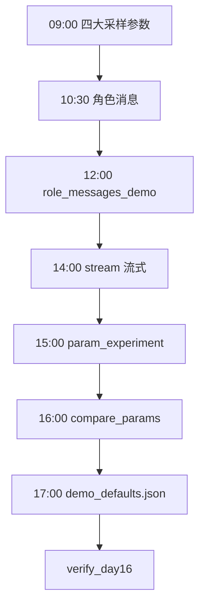
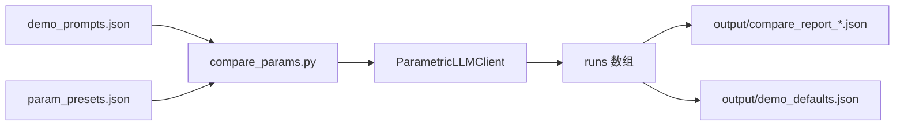

# Day 16 流程图与示意图

## 1. 一日学习流程



## 2. 采样决策（简化）

```text
模型输出 logits → softmax → 概率分布 P(token)
        │
        ├─ temperature 调整分布「尖锐/平坦」
        │
        ├─ top_p 截断低概率尾部
        │
        └─ 采样得到下一个 token → 拼接到上下文 → 循环
```

## 3. 流式 vs 非流式时序

```text
非流式:
  Client ──POST──▶ Server ........ 生成完毕 ........──▶ 完整 JSON

流式:
  Client ──POST stream──▶ Server
         ◀── chunk1 ──
         ◀── chunk2 ──
         ◀── chunk3 ──
         ◀── [DONE] ──
```

## 4. compare_params 管道



## 5. 角色消息在多轮中的增长

```text
轮1: [system] [user1] → assistant1
轮2: [system] [user1] [assistant1] [user2] → assistant2
轮3: [system] [user1] [assistant1] [user2] [assistant2] [user3] → ...

Token 成本随历史增长 —— Day15 已预警
```

## 6. 参数 preset 对比矩阵（示意）

```text
preset          │ temp │ top_p │ max_tok │ freq_pen │ 预期
────────────────┼──────┼───────┼─────────┼──────────┼──────────
stable          │ 0.0  │ 1.0   │ 256     │ 0.0      │ 最稳最短
demo_balanced   │ 0.3  │ 0.9   │ 512     │ 0.3      │ 推荐演示
creative        │ 1.0  │ 0.95  │ 800     │ 0.0      │ 多样易飘
```

---

**实操**：`cd day16/code && python3 compare_params.py --prompt-id customer_demo`
