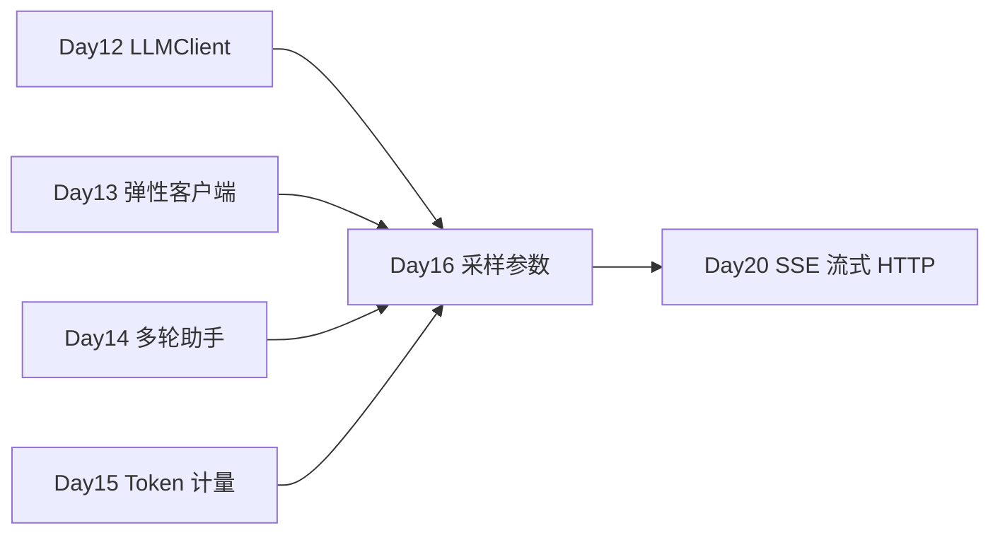

# Day 16 · 采样参数 · 角色消息 · 流式输出 · 客户演示调参

> **旁白（讲师口吻）**  
> 周二下午，市场部要把星火智服拉进客户会议室做 **30 分钟演示**。老板叮嘱：*「回答别太飘，也别像机器人；首字要快出来，别干等 10 秒。」*  
> 张工在 Day 14 助手配置旁写了四个旋钮：`temperature`、`top_p`、`max_tokens`、`frequency_penalty`，再加 `stream=True` 打字机效果。  
> **今日任务**：同一 prompt 多组参数对比报告 + 为演示调出一套 **默认参数 JSON**。

---

## 今日学习地图

| 时段 | 主题 | 产出物 |
|------|------|--------|
| 09:00–10:30 | temperature / top_p / max_tokens / frequency_penalty | `04_课堂讲义.md` 第一～三章 |
| 10:30–12:00 | system / user / assistant 角色与消息结构 | `role_messages_demo.py` |
| 14:00–15:00 | `stream=True` 流式打字机效果 | `stream_demo.py` |
| 15:00–16:30 | 同 prompt 多参数实验与对比报告 | `param_experiment.py` + `compare_params.py` |
| 16:30–17:30 | 客户演示默认参数定稿 | `output/demo_defaults.json` |
| 19:00–21:00 | 作业 + Git commit | `homework/day16/` |

## 与前后课程的衔接



| 前序能力 | 今日升级 |
|----------|----------|
| Day 12 `chat(messages)` | 传入 temperature 等 kwargs |
| Day 13 mock/live 分支 | 流式 mock 生成器模拟 |
| Day 15 Token 成本 | max_tokens 限制输出成本 |
| Day 14 系统提示 | 角色消息规范化为演示人设 |

## 今日文件清单

| 文件 | 用途 |
|------|------|
| [01_业务背景.md](./01_业务背景.md) | 客户演示调参 deadline |
| [02_需求文档.md](./02_需求文档.md) | 参数对比与默认配置 PRD |
| [03_架构与设计.md](./03_架构与设计.md) | ParametricClient、流式管道 |
| [04_课堂讲义.md](./04_课堂讲义.md) | **主课**（参数 + 角色 + 流式） |
| [05_流程图与示意图.md](./05_流程图与示意图.md) | 采样、流式、对比报告流程 |
| [06_课后作业.md](./06_课后作业.md) | 必做 / 选做 / 挑战 |
| [07_作业参考答案.md](./07_作业参考答案.md) | 参考答案与讲评要点 |
| [08_补充讲义.md](./08_补充讲义.md) | presence_penalty、stop、seed |
| [code/param_experiment.py](./code/param_experiment.py) | 单参数扫描实验 |
| [code/stream_demo.py](./code/stream_demo.py) | **流式打字机** |
| [code/role_messages_demo.py](./code/role_messages_demo.py) | 三角色消息演示 |
| [code/compare_params.py](./code/compare_params.py) | **对比报告 CLI** |
| [code/llm_compat.py](./code/llm_compat.py) | 扩展参数 + 流式 + Day12–14 衔接 |
| [code/verify_day16.py](./code/verify_day16.py) | 自动化验收 |
| [code/data/demo_prompts.json](./code/data/demo_prompts.json) | 演示用 prompt 集 |
| [code/requirements.txt](./code/requirements.txt) | 依赖清单 |
| [code/.env.example](./code/.env.example) | 环境变量模板 |

## 今日验收标准

- [ ] 能解释 temperature 与 top_p 对多样性的影响  
- [ ] 能说明 max_tokens 如何限制输出与成本  
- [ ] 能构造含 system/user/assistant 的 messages  
- [ ] `stream_demo.py` 在终端呈现打字机效果（mock 可跑）  
- [ ] `compare_params.py` 生成同 prompt 多参数 JSON 报告  
- [ ] `output/demo_defaults.json` 含推荐演示参数及理由  
- [ ] 无 API Key 时 mock 模式全绿  
- [ ] `python3 verify_day16.py` 全部 `[OK]`  
- [ ] Git 已提交，commit message 含 `day16`

## 快速开始

```bash
cd day16/code
pip install -r requirements.txt
cp .env.example .env

python3 role_messages_demo.py
python3 stream_demo.py
python3 param_experiment.py --param temperature
python3 compare_params.py --prompt-id customer_demo
python3 verify_day16.py
```

---

**讲师提醒**：客户演示推荐起点：`temperature=0.3`, `top_p=0.9`, `max_tokens=512`, `frequency_penalty=0.3`, `stream=True`。用 `compare_params.py` 拿数据说话，别凭感觉调参。

**状态**：✅ Day 16 完整课件已发布
