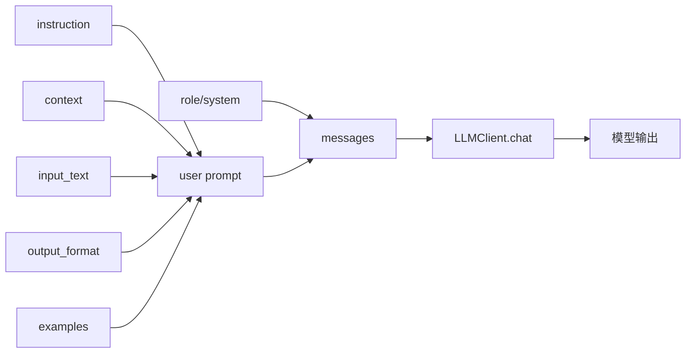

# Day 17 架构与设计 · Prompt 模板层

## 1. 总体架构

```text
┌─────────────────────────────────────────────────────────────────────┐
│                         入口层（可执行脚本）                            │
│  prompt_templates.py / few_shot_demo.py / verify_day17.py            │
└────────────────────────────┬────────────────────────────────────────┘
                             │ import
                             ▼
┌─────────────────────────────────────────────────────────────────────┐
│                    模板层 prompt_templates.py                          │
│   PromptTemplate ──load──▶ prompt_library/*.json                     │
│        │ build_user_prompt() / to_messages()                         │
└────────────────────────────┬────────────────────────────────────────┘
                             │ messages
                             ▼
┌─────────────────────────────────────────────────────────────────────┐
│                    客户端层 llm_client.py                              │
│   LLMClient.chat(messages) ──▶ mock | live                         │
└─────────────────────────────────────────────────────────────────────┘
```

**设计原则**（张工规范）：

1. **模板与代码分离**：业务同学可改 JSON，不需动 Python  
2. **四要素显式化**：每个字段对应 PRD 一节，Code Review 可逐条核对  
3. **分隔符统一**：默认 `<<<input>>>`，与 Day 18 注入防御一致  
4. **mock 可测**：关键词路由，CI 不依赖外网  

## 2. Prompt 四要素数据流



## 3. Shot 策略选型

| 策略 | 示例数 | 适用 | Token 成本 |
|------|--------|------|------------|
| zero-shot | 0 | 通用任务、模型能力强 | 低 |
| one-shot | 1 | 格式约束、单点示范 | 中 |
| few-shot | 2–5 | 分类、抽取、风格迁移 | 高 |

**经验法则**：先 zero-shot + 清晰 `output_format`；不稳再加 one-shot；仍不稳再 few-shot。

## 4. 分隔符设计

```text
<<<input>>>
用户原始输入（不可信）
<<<\/input>>>
```

| 标签 | 用途 |
|------|------|
| `<<<input>>>` | 隔离待处理文本 |
| `<<<context>>>` | 隔离检索文档片段 |
| `<<<user_message>>>` | Day 18 客服场景 |

## 5. JSON 输出约束模式

1. **自然语言描述 schema**（Day 17）  
2. **嵌入完整 JSON 样例**（推荐）  
3. **API 层 `response_format`**（Day 18 JSON Mode）

```json
{"intent": "投诉退款", "confidence": 0.92}
```

## 6. 模块依赖

```text
few_shot_demo.py
    ├── prompt_templates.PromptTemplate
    └── llm_client.LLMClient

prompt_templates.py
    ├── prompt_library/*.json
    └── llm_client.LLMClient

verify_day17.py
    └── 上述全部
```

## 7. 与 Day 18 衔接

| Day 17 | Day 18 |
|--------|--------|
| JSON 样例约束 | `response_format: json_object` |
| 分类 Prompt | `intent_classifier.py` 完整管线 |
| 分隔符 | 注入防御 hardened messages |
| role 扮演 | 安全 system 指令加固 |

---

*架构评审：张工 · 2026-07-06*
