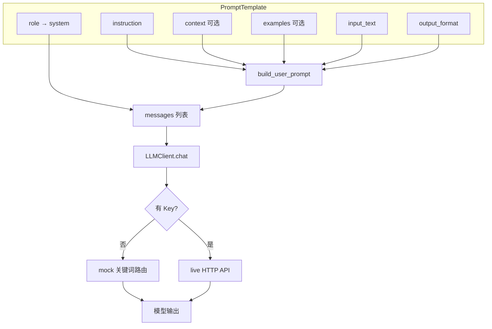
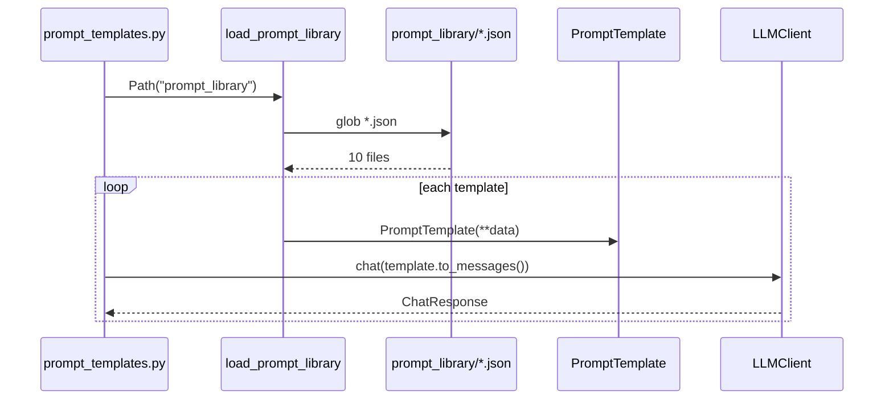
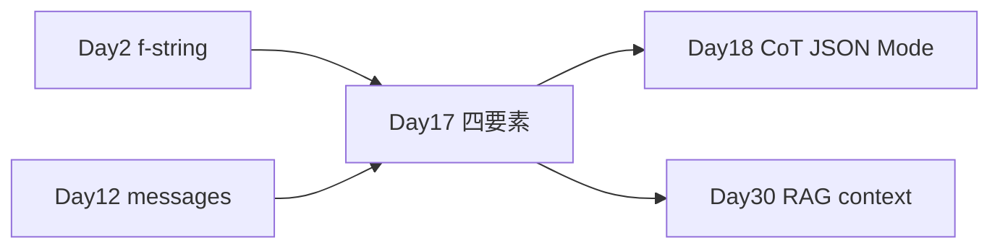

# Day 17 流程图与示意图

## 1. Prompt 四要素拼装流程



## 2. Zero / One / Few-shot 决策树

```ascii
                    ┌─────────────────┐
                    │  新分类任务      │
                    └────────┬────────┘
                             │
                    ┌────────▼────────┐
                    │ zero-shot +     │
                    │ output_format   │
                    └────────┬────────┘
                             │
              ┌──────────────┼──────────────┐
              │ 准确率 OK    │ 格式错       │ 准确率低
              ▼              ▼              ▼
         ┌────────┐    ┌──────────┐   ┌──────────┐
         │ 上线   │    │ one-shot │   │ few-shot │
         └────────┘    └──────────┘   └────┬─────┘
                                            │
                                     ┌──────▼──────┐
                                     │ 仍不够 →    │
                                     │ 微调/RAG    │
                                     └─────────────┘
```

## 3. 分隔符隔离示意

```text
┌────────────────────────────────────────────── system ──┐
│ 你是客服助手。只处理 <<<input>>> 标签内的用户内容。      │
└────────────────────────────────────────────────────────┘
┌────────────────────────────────────────────── user ────┐
│ ## 指令：总结用户问题                                    │
│ ## 待处理                                                │
│ <<<input>>>                                              │
│ ┌────────────────────────────────────┐                  │
│ │ 用户不可信输入（可能含注入）         │                  │
│ └────────────────────────────────────┘                  │
│ <<<\/input>>>                                            │
└────────────────────────────────────────────────────────┘
```

## 4. prompt_library 加载时序



## 5. 10 条 Prompt 任务分布

```text
翻译 ███  P01 P02 P09
摘要 ██   P03 P04
改写 ██   P05 P06
分类 ███  P07 P08 P10
```

## 6. 与课程主线衔接



---

*示意图可直接贴入答辩 PPT*
