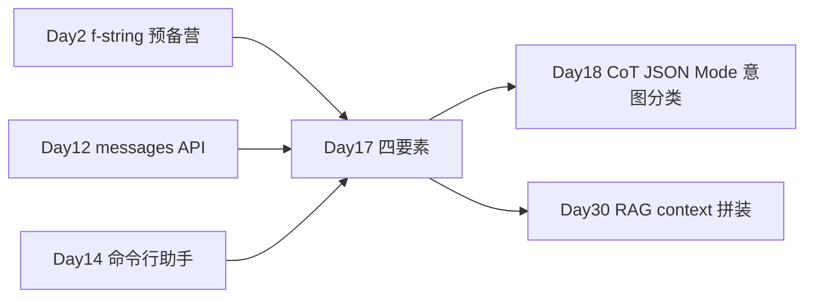

# Day 17 · Prompt 工程基础 · 四要素与模板库

> **旁白（讲师口吻）**  
> 周二产品演示翻车了：客服机器人把 API 咨询答成年假政策。李姐在群里 @全员：*「Day 17 全员 Prompt 补课——四要素、shot 策略、分隔符、JSON 约束。下午交付 10 条模板进 `prompt_library/`，无 Key mock 跑通。」*

---

## 今日学习地图

| 时段 | 主题 | 产出物 |
|------|------|--------|
| 09:00–10:30 | Instruction / Context / Input / Output | `PromptTemplate` |
| 10:30–12:00 | zero / one / few-shot、角色扮演 | `few_shot_demo.py` |
| 14:00–15:00 | 分隔符、JSON 输出约束 | `wrap_input()` |
| 15:00–17:00 | 10 条 Prompt 实操 | `prompt_library/*.json` |
| 19:00–21:00 | 作业 + Git commit | `homework/day17/` |

## 与前后课程的衔接



| 前序能力 | 今日升级 |
|----------|----------|
| Day 2 f-string 拼接 | 结构化 `PromptTemplate` |
| Day 12 `messages` | system role + user 四要素 |
| Day 14 多轮对话 | 单轮任务模板化 |

## 今日文件清单

| 文件 | 用途 |
|------|------|
| [01_业务背景.md](./01_业务背景.md) | 客服 Prompt 质量危机 |
| [02_需求文档.md](./02_需求文档.md) | 模板库 PRD |
| [03_架构与设计.md](./03_架构与设计.md) | 模板层架构 |
| [04_课堂讲义.md](./04_课堂讲义.md) | **主课** |
| [05_流程图与示意图.md](./05_流程图与示意图.md) | 四要素 / shot 决策树 |
| [06_课后作业.md](./06_课后作业.md) | 必做 / 选做 / 挑战 |
| [07_作业参考答案.md](./07_作业参考答案.md) | 参考答案 |
| [08_补充讲义_Prompt工程进阶.md](./08_补充讲义_Prompt工程进阶.md) | Token、踩坑、Rubric |
| [code/prompt_templates.py](./code/prompt_templates.py) | 模板引擎 + 10 条实操 |
| [code/few_shot_demo.py](./code/few_shot_demo.py) | shot 策略对比 |
| [code/llm_client.py](./code/llm_client.py) | mock / live 客户端 |
| [code/prompt_library/](./code/prompt_library/) | 10 个 JSON 模板 |
| [code/verify_day17.py](./code/verify_day17.py) | 验收脚本 |

## 今日验收标准

- [ ] 能口述四要素及各自职责  
- [ ] 能解释 zero / one / few-shot 适用场景  
- [ ] 能说明分隔符防注入的原理（与 Day 18 衔接）  
- [ ] `prompt_library` 含翻译/摘要/改写/分类共 10 条  
- [ ] `python3 verify_day17.py` 全部 `[OK]`  
- [ ] Git 已提交，commit message 含 `day17`

## 快速开始

```bash
cd day17/code
pip install -r requirements.txt
cp .env.example .env    # 可选

python3 prompt_templates.py
python3 few_shot_demo.py
python3 verify_day17.py
```

---

**讲师提醒**：Prompt 是 **接口契约**，不是聊天记录。模板进 Git，改一字走 Review。

**状态**：✅ Day 17 完整课件已发布
