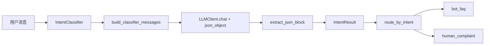
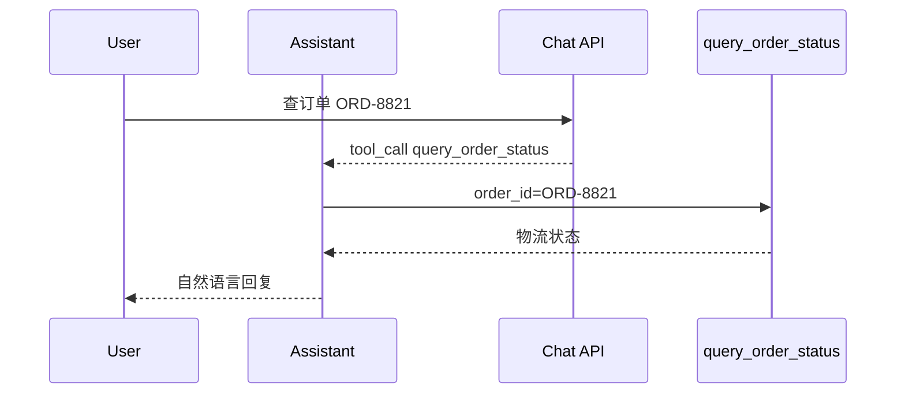

# Day 18 架构与设计 · 意图分类与安全管线

## 1. 总体架构

```text
┌─────────────────────────────────────────────────────────────────────┐
│  cot_demo / injection_defense / structured_output / intent_classifier │
└────────────────────────────┬────────────────────────────────────────┘
                             │
                             ▼
┌─────────────────────────────────────────────────────────────────────┐
│                      llm_client.LLMClient                            │
│   mock: CoT | intent JSON | injection guard | tool_calls            │
│   live: response_format | tools | chat/completions                    │
└─────────────────────────────────────────────────────────────────────┘
```

## 2. 意图分类数据流



## 3. 注入防御双层设计

```text
用户原始输入
      │
      ▼
┌─────────────┐     blocked=true
│ 规则 sanitize │ ─────────────────▶ 直接拒绝
└──────┬──────┘
       │ blocked=false
       ▼
┌─────────────┐
│ LLM guard   │  hardened system + <user_input>
└──────┬──────┘
       ▼
   safe_response JSON
```

**原则**：纵深防御——规则快、LLM 懂语义；任一层的 false negative 由另一层补。

## 4. JSON 输出策略对比

| 方式 | 可靠性 | 成本 | 本日 |
|------|--------|------|------|
| Prompt 样例 | 中 | 低 | Day 17 |
| JSON Mode API | 高 | 中 | Day 18 |
| Pydantic + 重试 | 高 | 高 | Day 22+ |
| Function Calling | 结构化工具参数 | 中 | Day 18 POC |

## 5. Function Calling 时序



## 6. CoT 与 Self-Consistency

| 技术 | 机制 | 成本 |
|------|------|------|
| CoT | 要求逐步思考 | 1x token |
| Self-Consistency | 多次采样 + 投票 | Nx token |
| ToT | 分支搜索 + 评估 | 远大于 Nx |

生产分类任务：**默认不用 CoT**（要 JSON 不要推理过程）；数学/逻辑推理任务才用。

## 7. 模块依赖

```text
intent_classifier.py → llm_client.py
injection_defense_demo.py → llm_client.py
structured_output_demo.py → llm_client.py
cot_demo.py → llm_client.py
verify_day18.py → 全部
```

---

*张工评审通过 · 2026-07-06*
