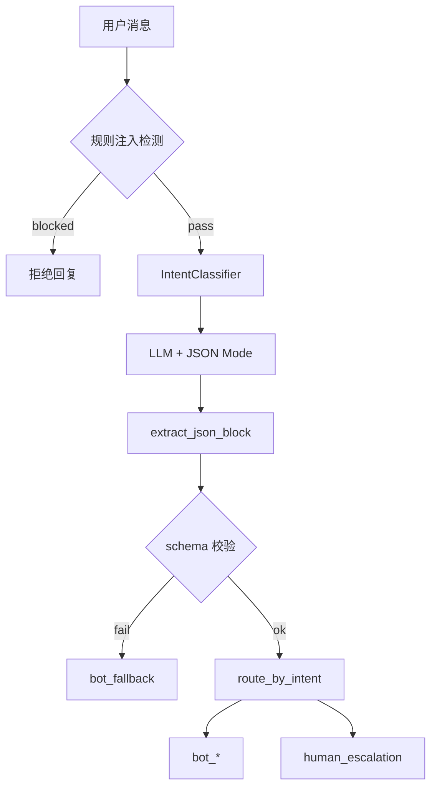
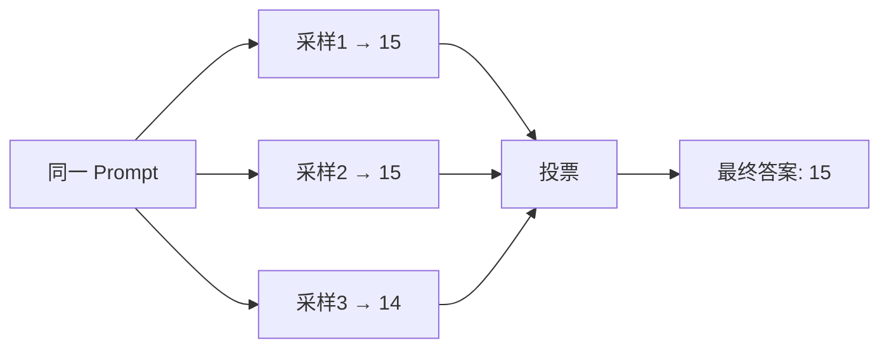
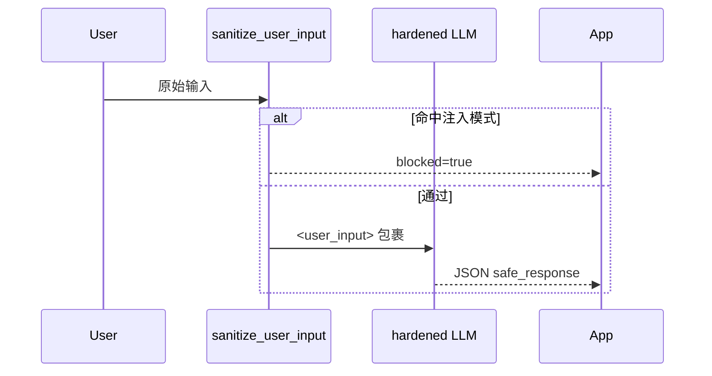
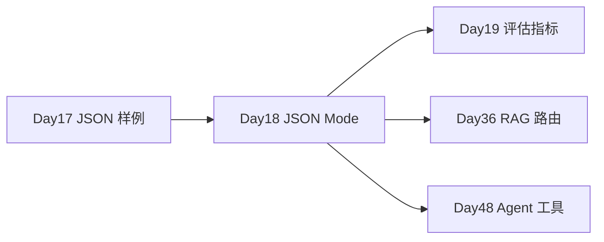

# Day 18 流程图与示意图

## 1. 意图分类端到端



## 2. CoT vs Direct

```ascii
Direct:  问题 ──────────────────────▶ 答案

CoT:     问题 ──▶ 步骤1 ──▶ 步骤2 ──▶ 步骤3 ──▶ 答案
                      └──── Self-Consistency 多次投票 ────┘
```

## 3. Self-Consistency 投票



## 4. Tree of Thoughts 分支

```text
                    用户投诉物流延迟
                           │
         ┌─────────────────┼─────────────────┐
         ▼                 ▼                 ▼
    道歉+补偿券        解释天气原因        转人工专员
    score=0.82         score=0.45         score=0.91 ★
```

## 5. 注入防御双层



## 6. Function Calling 流程

```text
User: 查订单 ORD-8821
         │
         ▼
    Chat API (tools=[query_order_status])
         │
         ▼
    tool_call: {order_id: "ORD-8821"}
         │
         ▼
    本地 query_order_status()
         │
         ▼
    Assistant: 您的订单已发货…
```

## 7. 课程衔接



---

*示意图可用于安全评审 PPT*
