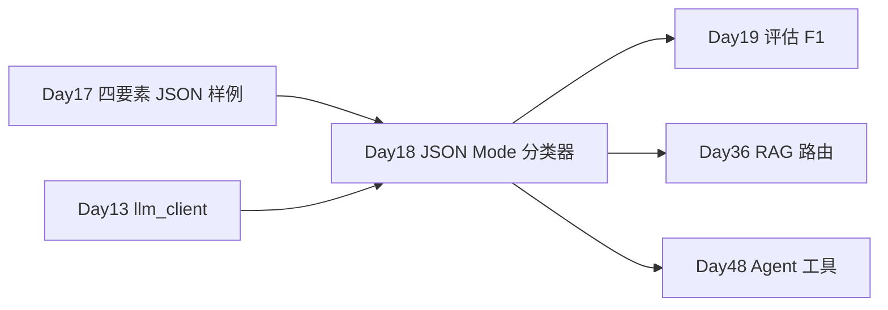

# Day 18 · 高级 Prompt · CoT · 结构化输出 · 意图分类

> **旁白**  
> 灰度第二天安全组亮红灯：意图 JSON 解析失败、注入样例穿透。王工 deadline：*「Day 18 交付意图分类器 + 注入防御；分类走 JSON Mode；查订单做 Function Calling POC。」*

---

## 今日学习地图

| 时段 | 主题 | 产出物 |
|------|------|--------|
| 09:00–10:00 | Chain-of-Thought | `cot_demo.py` |
| 10:00–11:15 | Self-Consistency / ToT 概念 | `cot_demo.py` |
| 11:15–12:00 | Prompt 注入 / Jailbreak 防御 | `injection_defense_demo.py` |
| 14:00–14:45 | JSON Mode、Function Calling | `structured_output_demo.py` |
| 14:45–17:00 | **智能客服意图分类器** | `intent_classifier.py` |
| 19:00–21:00 | 作业 | `homework/day18/` |

## 与前后课程衔接



## 今日文件清单

| 文件 | 用途 |
|------|------|
| [01_业务背景.md](./01_业务背景.md) | 灰度安全审计 |
| [02_需求文档.md](./02_需求文档.md) | 意图分类 PRD |
| [03_架构与设计.md](./03_架构与设计.md) | 分类与安全架构 |
| [04_课堂讲义.md](./04_课堂讲义.md) | **主课** |
| [05_流程图与示意图.md](./05_流程图与示意图.md) | CoT / 注入 / FC |
| [06_课后作业.md](./06_课后作业.md) | 分层作业 |
| [07_作业参考答案.md](./07_作业参考答案.md) | 参考答案 |
| [08_补充讲义_结构化输出与安全.md](./08_补充讲义_结构化输出与安全.md) | JSON Mode、合规 |
| [code/cot_demo.py](./code/cot_demo.py) | CoT / 自洽 / ToT |
| [code/intent_classifier.py](./code/intent_classifier.py) | **主项目** |
| [code/injection_defense_demo.py](./code/injection_defense_demo.py) | 注入防御 |
| [code/structured_output_demo.py](./code/structured_output_demo.py) | JSON Mode + FC |
| [code/llm_client.py](./code/llm_client.py) | mock / live |
| [code/verify_day18.py](./code/verify_day18.py) | 验收 |
| [code/data/sample_queries.txt](./code/data/sample_queries.txt) | 样例消息 |

## 今日验收标准

- [ ] 能解释 CoT 适用场景（推理 vs 分类）  
- [ ] 能描述注入防御双层管线  
- [ ] `intent_classifier.py` 批量输出 JSON + 路由  
- [ ] `structured_output_demo.py` 演示 JSON Mode 与 tool_calls  
- [ ] `python3 verify_day18.py` 全部 `[OK]`  
- [ ] Git commit 含 `day18`

## 快速开始

```bash
cd day18/code
pip install -r requirements.txt
cp .env.example .env    # 可选

python3 cot_demo.py
python3 injection_defense_demo.py
python3 structured_output_demo.py
python3 intent_classifier.py
python3 verify_day18.py
```

---

**讲师提醒**：分类任务要 **短、稳、可解析**；CoT 留给推理题，别滥用。

**状态**：✅ Day 18 完整课件已发布
