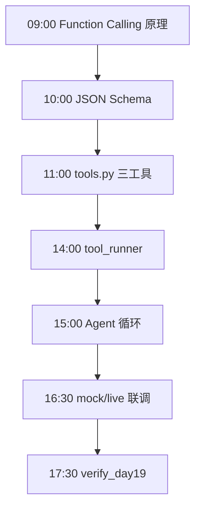
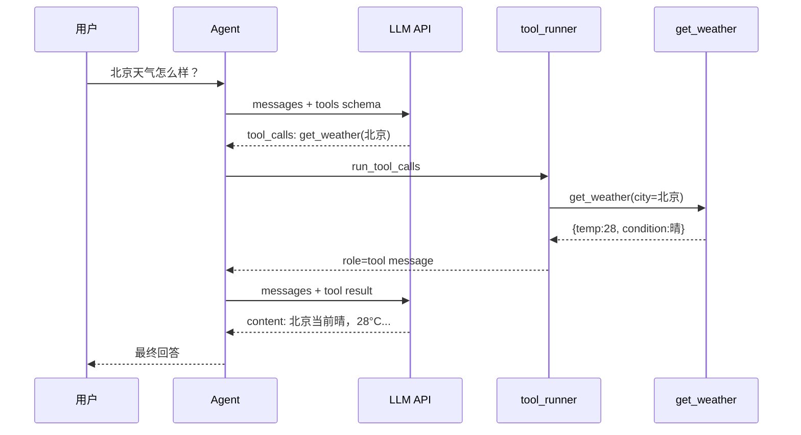

# Day 19 流程图与示意图

## 1. 一日学习流程



## 2. Function Calling 时序



## 3. Agent 状态机

```text
        ┌─────────────┐
        │   START     │
        └──────┬──────┘
               │ append user message
               ▼
        ┌─────────────┐
   ┌───▶│  CALL LLM   │
   │    └──────┬──────┘
   │           │
   │     ┌─────┴─────┐
   │     ▼           ▼
   │  tool_calls?   no → FINAL_ANSWER → END
   │     │
   │     ▼ yes
   │  ┌─────────────┐
   │  │ RUN TOOLS   │
   │  └──────┬──────┘
   │         │ append tool messages
   │         ▼
   │    round < max?
   │         │
   └─────────┘ yes
             no → TIMEOUT_MSG → END
```

## 4. 模块依赖

```text
function_calling_agent.py
    ├── llm_client.ToolCallingLLMClient
    ├── schemas.load_all_schemas
    └── tool_runner.run_tool_calls

tool_runner.py
    └── tools.TOOL_REGISTRY

tools.py
    └── data/mock_products.json
```

## 5. messages 数组增长示意

```text
Step 0:  [system, user]
Step 1:  [system, user, assistant+tool_calls]
Step 2:  [system, user, assistant+tool_calls, tool]
Step 3:  [system, user, assistant+tool_calls, tool, assistant final]
```

## 6. 三工具数据流

```text
get_weather ──▶ MOCK_WEATHER 字典
calculate   ──▶ ast.parse 安全树
query_products ──▶ mock_products.json 过滤匹配
```

---

**讲师备注**：时序图建议让学员上台补全「tool 消息塞回」那一步。
