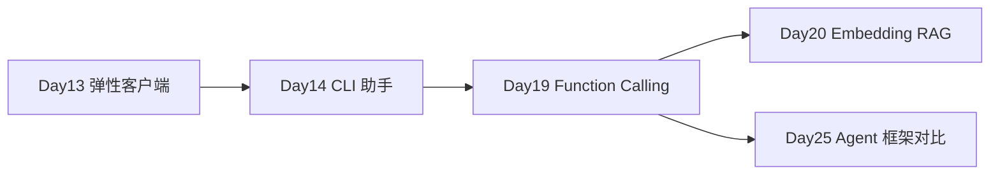

# Day 19 · Function Calling / Tool Use（KEY）· 手写 Agent 循环

> **旁白（讲师口吻）**  
> 周五产品评审，王工演示的「智能客服」只会瞎编天气和库存。张工当场打断：*「LLM 不是数据库，需要 **工具** 才能查真数据。Day 19 不讲 LangChain，你们 **手写 Function Calling 循环**——schema 给模型、模型返回 tool_call、你们执行、结果塞回去，直到出最终答案。」*

---

## 今日学习地图

| 时段 | 主题 | 产出物 |
|------|------|--------|
| 09:00–10:30 | Function Calling 原理、JSON Schema、OpenAI tools 参数 | `schemas/` |
| 10:30–12:00 | 工具实现：天气 + 计算器 + 产品库查询 | `tools.py` |
| 14:00–15:00 | tool_runner：解析 arguments、执行、生成 tool 消息 | `tool_runner.py` |
| 15:00–16:30 | 纯 API Agent 循环（无框架） | `function_calling_agent.py` |
| 16:30–17:30 | 多工具联调、mock 模式验收 | `verify_day19.py` |
| 19:00–21:00 | 作业 + Git commit | `homework/day19/` |

## 与前后课程的衔接



| 前序能力 | 今日升级 |
|----------|----------|
| Day 12/13 `chat(messages)` | 增加 `tools` + `tool_calls` 往返 |
| Day 11 JSON 文件 IO | 产品库 `mock_products.json` |
| Day 6 安全 eval 预习 | `calculate` 用 AST 白名单 |

## 今日文件清单

| 文件 | 用途 |
|------|------|
| [01_业务背景.md](./01_业务背景.md) | 客服瞎编数据事故与工具调用 deadline |
| [02_需求文档.md](./02_需求文档.md) | Function Calling Agent PRD |
| [03_架构与设计.md](./03_架构与设计.md) | Schema / Runner / Agent 三层架构 |
| [04_课堂讲义.md](./04_课堂讲义.md) | **主课**（schema → 循环 → 多工具） |
| [05_流程图与示意图.md](./05_流程图与示意图.md) | tool_call 时序、Agent 状态机 |
| [06_课后作业.md](./06_课后作业.md) | 必做 / 选做 / 挑战 |
| [07_作业参考答案.md](./07_作业参考答案.md) | 参考答案与讲评要点 |
| [08_补充讲义_FunctionCalling进阶.md](./08_补充讲义_FunctionCalling进阶.md) | parallel tools、错误处理、与 MCP 对比 |
| [code/schemas/](./code/schemas/) | 三工具 OpenAI JSON Schema |
| [code/tools.py](./code/tools.py) | 天气 / 计算 / 产品库 |
| [code/tool_runner.py](./code/tool_runner.py) | 执行 tool_calls |
| [code/llm_client.py](./code/llm_client.py) | 支持 tools 的 LLM 客户端 |
| [code/function_calling_agent.py](./code/function_calling_agent.py) | **手写 Agent 主程序** |
| [code/verify_day19.py](./code/verify_day19.py) | 验收脚本 |

## 今日验收标准

- [ ] 能口述 Function Calling 四步：schema → tool_call → execute → tool message  
- [ ] 能解释 `tool_calls` 与 `role=tool` 消息在 messages 数组中的位置  
- [ ] 三工具 schema 可从 `schemas/` 加载并传给 API  
- [ ] `tool_runner.py` 能解析 JSON arguments 并路由到 Python 函数  
- [ ] `function_calling_agent.py` 在 mock 模式完成「天气 + 计算」多轮对话  
- [ ] 无 `OPENAI_API_KEY` 时 `verify_day19.py` 全部 `[OK]`  
- [ ] Git 已提交，commit message 含 `day19`

## 快速开始

```bash
cd day19/code
pip install -r requirements.txt
cp .env.example .env               # 可选：填入真实 Key 测 live 模式

python3 tools.py
python3 tool_runner.py
python3 llm_client.py
python3 function_calling_agent.py
python3 verify_day19.py
```

---

**讲师提醒**：今日重点是 **看懂 Agent 循环**，不是背 LangChain API。mock 模式用启发式返回 `tool_calls`，让你没 Key 也能走完整链路。

**状态**：✅ Day 19 完整课件已发布
