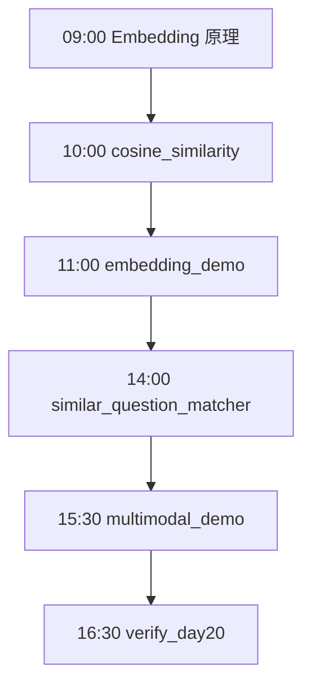
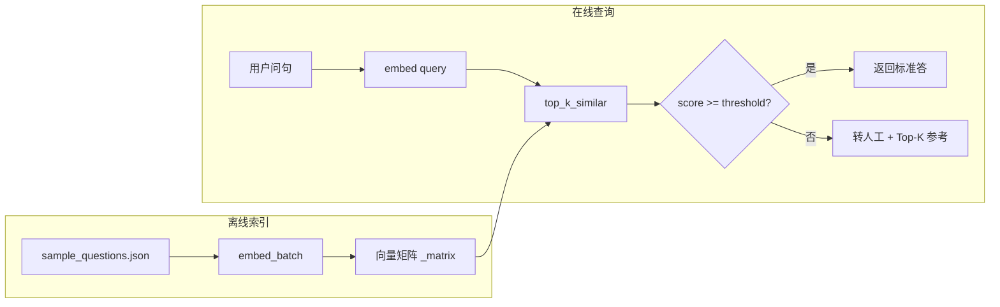
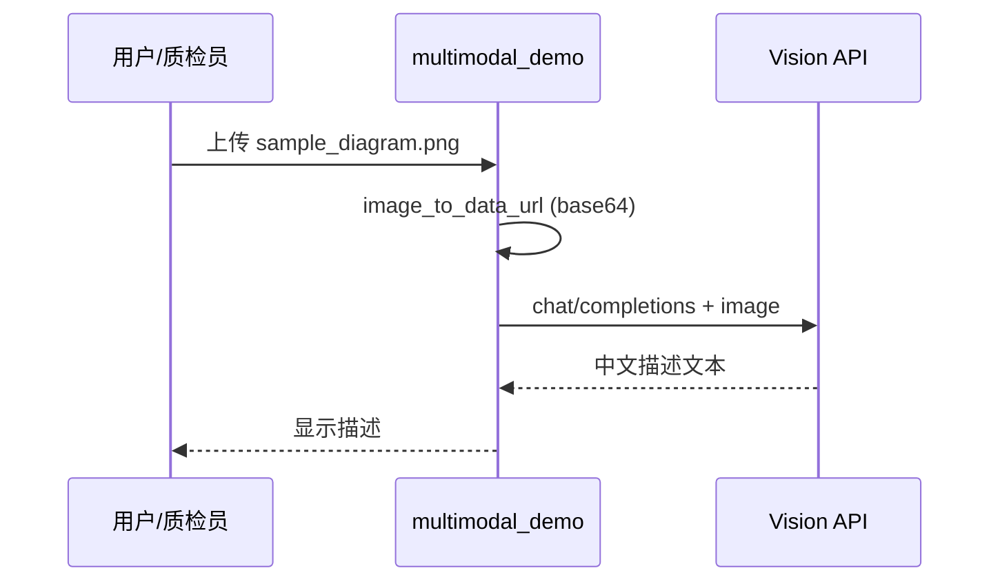

# Day 20 流程图与示意图

## 1. 一日学习流程



## 2. FAQ 相似问检索流程



## 3. 余弦相似度几何示意

```text
        B
       /
      /  θ 越小 → cosine 越大
     /_____
    A      C

A 与 B 夹角小 → 语义相近
A 与 C 夹角大 → 语义无关
```

## 4. 多模态调用时序



## 5. 模块依赖

```text
similar_question_matcher.py
    ├── embedding_demo.EmbeddingClient
    ├── cosine_similarity.top_k_similar
    └── sample_questions.json

embedding_demo.py
    └── cosine_similarity（demo 相似度预览）

multimodal_demo.py
    └── 独立（Vision API）
```

## 6. mock embedding 特征流

```text
输入文本
    ├─ 1~3 字符 n-gram ──哈希──▶ 维度桶 ±1
    └─ 主题词（退款/密码/物流）──▶ 桶 +2.5
              │
              ▼
         L2 归一化 → 单位向量
```

---

**讲师备注**：用两张相似问 + 一张无关问现场算 cosine，直观感受数值差异。
