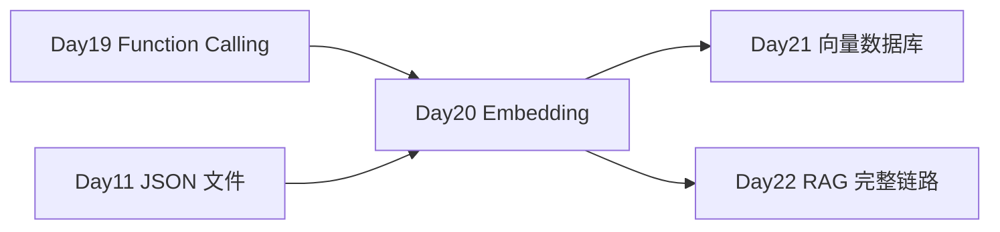

# Day 20 · Multimodal 与 Embeddings · 相似问匹配

> **旁白（讲师口吻）**  
> 周一早会，客服主管吐槽：*「FAQ 两千条，用户问『咋退款』『如何退钱』『能退吗』——全当新问题转人工。张工说 Day 20 上 **Embedding + 余弦相似度**，再做 **图像理解** 预习。无 Key 用 mock 向量，NumPy 手算 cosine。」*

---

## 今日学习地图

| 时段 | 主题 | 产出物 |
|------|------|--------|
| 09:00–10:30 | Embedding 原理、向量空间、OpenAI embeddings API | `embedding_demo.py` |
| 10:30–12:00 | 余弦相似度、NumPy 实现 | `cosine_similarity.py` |
| 14:00–15:30 | 相似问匹配工具、FAQ 索引 | `similar_question_matcher.py` |
| 15:30–16:30 | 多模态 API：图像理解 | `multimodal_demo.py` |
| 16:30–17:30 | 联调验收 | `verify_day20.py` |
| 19:00–21:00 | 作业 + Git commit | `homework/day20/` |

## 与前后课程的衔接



| 前序能力 | 今日升级 |
|----------|----------|
| Day 11 JSON FAQ 数据 | `sample_questions.json` 向量索引 |
| Day 19 工具调用 | 相似问匹配可作为 Agent 工具 |
| NumPy 基础 | 手算 cosine similarity |

## 今日文件清单

| 文件 | 用途 |
|------|------|
| [01_业务背景.md](./01_业务背景.md) | FAQ 重复问句与多模态需求 |
| [02_需求文档.md](./02_需求文档.md) | Embedding 匹配器 PRD |
| [03_架构与设计.md](./03_架构与设计.md) | 向量化、检索、多模态架构 |
| [04_课堂讲义.md](./04_课堂讲义.md) | **主课**（embedding → cosine → 匹配） |
| [05_流程图与示意图.md](./05_流程图与示意图.md) | 向量检索流程、多模态时序 |
| [06_课后作业.md](./06_课后作业.md) | 必做 / 选做 / 挑战 |
| [07_作业参考答案.md](./07_作业参考答案.md) | 参考答案与讲评要点 |
| [08_补充讲义_Embedding与多模态进阶.md](./08_补充讲义_Embedding与多模态进阶.md) | 降维、重排序、Vision 细节 |
| [code/sample_questions.json](./code/sample_questions.json) | FAQ 样本库 |
| [code/cosine_similarity.py](./code/cosine_similarity.py) | NumPy 余弦相似度 |
| [code/embedding_demo.py](./code/embedding_demo.py) | Embedding 客户端 |
| [code/similar_question_matcher.py](./code/similar_question_matcher.py) | **相似问匹配器** |
| [code/multimodal_demo.py](./code/multimodal_demo.py) | 图像理解演示 |
| [code/verify_day20.py](./code/verify_day20.py) | 验收脚本 |

## 今日验收标准

- [ ] 能口述 Embedding：文本 → 高维向量，语义相近则向量接近  
- [ ] 能手写余弦相似度公式并用 NumPy 实现  
- [ ] `similar_question_matcher.py` 能将「如何申请退款」匹配到标准问  
- [ ] 理解 mock embedding 与 live API 的区别  
- [ ] `multimodal_demo.py` 在 mock 模式描述图片  
- [ ] 无 `OPENAI_API_KEY` 时 `verify_day20.py` 全部 `[OK]`  
- [ ] Git 已提交，commit message 含 `day20`

## 快速开始

```bash
cd day20/code
pip install -r requirements.txt
cp .env.example .env               # 可选：live embedding / vision

python3 cosine_similarity.py
python3 embedding_demo.py
python3 similar_question_matcher.py
python3 multimodal_demo.py
python3 verify_day20.py
```

---

**讲师提醒**：mock embedding 用 n-gram + 关键词特征，**教学可跑**；生产请换真实模型。

**状态**：✅ Day 20 完整课件已发布
