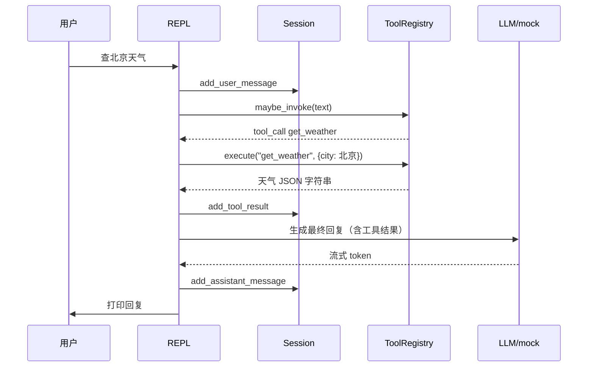
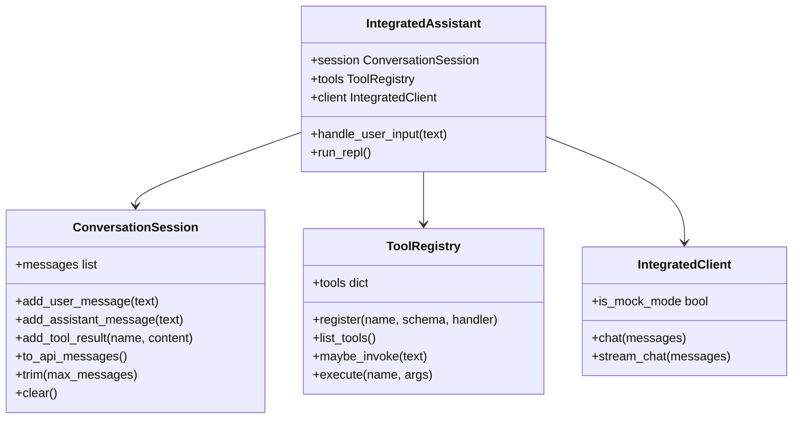

# Day 21 架构与设计 · 综合助手模块与 Agent 工具环

## 1. 总体架构

```text
┌─────────────────────────────────────────────────────────────────────┐
│                         REPL 入口 integrated_assistant.py              │
│   /help /clear /tools /stream /history /exit                          │
└────────────────────────────┬────────────────────────────────────────┘
                             │
         ┌───────────────────┼───────────────────┐
         ▼                   ▼                   ▼
┌─────────────────┐ ┌─────────────────┐ ┌─────────────────┐
│ ConversationSession │ │  ToolRegistry   │ │ IntegratedClient │
│ messages 历史   │ │ 3 个 mock 工具  │ │ chat / stream   │
│ trim 截断       │ │ maybe_invoke    │ │ mock / live     │
└────────┬────────┘ └────────┬────────┘ └────────┬────────┘
         │                   │                   │
         └───────────────────┴───────────────────┘
                             │
                             ▼
                    ┌─────────────────┐
                    │  Agent 工具环    │
                    │ 最多 3 轮 tool   │
                    └─────────────────┘
```

**设计原则**（张工规范）：

1. **单一入口**：所有能力通过 `IntegratedAssistant` 类暴露，不散落脚本  
2. **mock 优先**：关键词路由 + 确定性工具结果，课堂零 Key  
3. **流式可选**：`stream_enabled` 开关，不破坏非流式路径  
4. **有界递归**：工具环 `MAX_TOOL_ROUNDS=3`，防 Agent 死循环  

## 2. Agent 工具调用环



### 2.1 mock 路由 vs live tool_calls

| 模式 | 工具触发方式 | 适用 |
|------|--------------|------|
| mock | `maybe_invoke` 关键词匹配 | 课堂、CI、无 Key |
| live | OpenAI `tools` + `tool_calls` 响应 | 有 Key 答辩加分 |

今日默认 mock；`IntegratedClient` 预留 live 分支结构。

## 3. 类图



## 4. 流式数据流

```text
完整回复 text = "上海当前天气：晴，26°C"
        │
        ▼
stream_tokens(text) 生成器
        │
        ├─ yield "上海"
        ├─ yield "当前"
        ├─ yield "天气"
        └─ ...
        │
        ▼
REPL: for chunk in stream:
          print(chunk, end="", flush=True)
```

与 Day 20 SSE 对比：

| 层 | Day 20 | Day 21 |
|----|--------|--------|
| 传输 | HTTP `text/event-stream` | 终端 stdout |
| 解析 | `httpx` line iterator | Python 生成器 |
| 消费 | 浏览器 EventSource | `print(..., flush=True)` |

## 5. 消息格式

```json
[
  {"role": "system", "content": "你是星火智服助手..."},
  {"role": "user", "content": "查上海天气"},
  {"role": "assistant", "content": "[tool_call] get_weather({\"city\": \"上海\"})"},
  {"role": "user", "content": "[tool_result:get_weather] {\"city\": \"上海\", \"temp_c\": 26}"},
  {"role": "assistant", "content": "上海当前天气：晴，26°C..."}
]
```

教学说明：OpenAI 正式 API 中 tool 消息为独立 `role: "tool"`；今日 CLI 用 user 前缀 `[tool_result:...]` 简化打印，Day 24 HTTP 层改为标准格式。

## 6. 配置项

| 环境变量 | 默认 | 说明 |
|----------|------|------|
| `OPENAI_API_KEY` | 空 | 空则 mock |
| `OPENAI_MODEL` | gpt-4o-mini | 模型名 |
| `SPARKTECH_MOCK` | 1 | 强制 mock |
| `STREAM_DEFAULT` | on | 默认流式开关 |

## 7. 与 Day 22/24 的接口契约（预告）

Day 22 静态 UI 将模拟以下 JSON（Day 24 真实对接）：

```json
POST /api/chat
{
  "message": "查上海天气",
  "session_id": "demo-001",
  "stream": true
}
```

响应（流式）：`data: {"delta": "上"}\n\n`

今日 CLI 输出的工具名、回复文案，即为前端 Mock 数据源。

## 8. 扩展点

| 扩展 | 位置 | 建议做法 |
|------|------|----------|
| 新工具 | `ToolRegistry.register` | 复制 `get_weather` 模式 |
| 真实 tool_calls | `IntegratedClient._live_chat` | 解析 `response.choices[0].message.tool_calls` |
| HTTP 暴露 | 新文件 `api_server.py` | Day 24 从本模块 import `IntegratedAssistant` |
| pytest | `tests/test_session.py` | 延续 Day 15 习惯 |

---

**架构评审结论**：模块边界清晰，mock 路径可独立验收；live 路径为选做，不阻塞 Week 4 前端排期。
