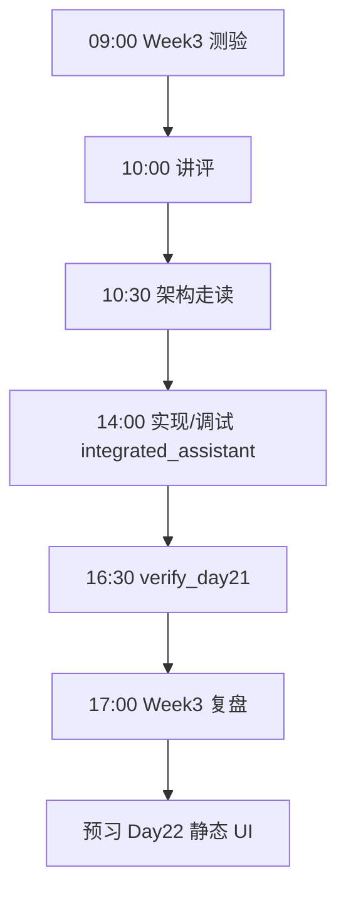
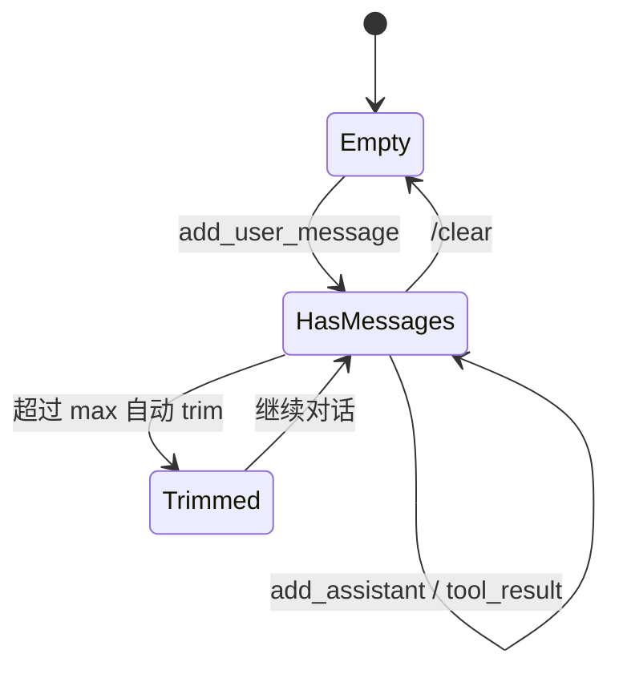
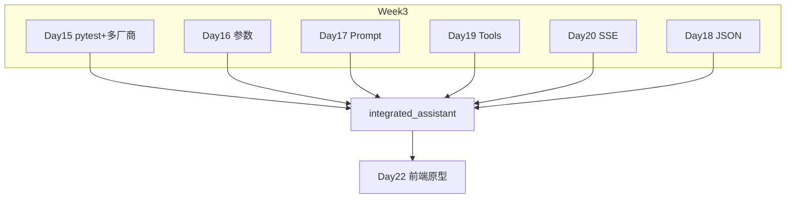

# Day 21 流程图与示意图

## 1. 一日学习流程



## 2. Agent 工具环（mock 模式）

```text
用户: "查上海天气"
        │
        ▼
┌───────────────────┐
│ maybe_invoke      │── 关键词命中 "天气"
└─────────┬─────────┘
          ▼
┌───────────────────┐
│ execute           │── get_weather(city=上海)
│ get_weather       │
└─────────┬─────────┘
          ▼
┌───────────────────┐
│ add_tool_result   │── 写入 session
└─────────┬─────────┘
          ▼
┌───────────────────┐
│ stream_chat       │── 基于工具结果生成自然语言
└─────────┬─────────┘
          ▼
     打印给用户
```

## 3. 流式输出时序

```text
IntegratedClient.stream_chat
        │
        ├─ t0  yield "上"
        ├─ t1  yield "海"
        ├─ t2  yield "当"
        ├─ t3  yield "前"
        └─ ... StopIteration
                │
                ▼
        session.add_assistant_message(完整文本)
```

## 4. Session 消息生命周期



## 5. mock vs live 分支

```text
                    ┌─────────────┐
                    │ Integrated  │
                    │ Client.chat │
                    └──────┬──────┘
                           │
              ┌────────────┴────────────┐
              ▼                         ▼
       ┌─────────────┐           ┌─────────────┐
       │ is_mock_mode│           │  live API   │
       │ 关键词工具   │           │ tool_calls  │
       │ 确定性回复   │           │ 真实模型    │
       └─────────────┘           └─────────────┘
```

## 6. Week 3 知识汇合图



## 7. REPL 命令分发

```text
input ──▶ strip
            │
    ┌───────┴───────┐
    │ 以 / 开头？    │
    └───────┬───────┘
      yes   │   no
       ▼    │    ▼
  CommandHandler  handle_user_input
  /help           (工具环+流式)
  /clear
  /tools
  /stream
  /exit
```

---

**讲师白板提示**：画图时强调 **工具环是有界循环**，不是 `while True`。
