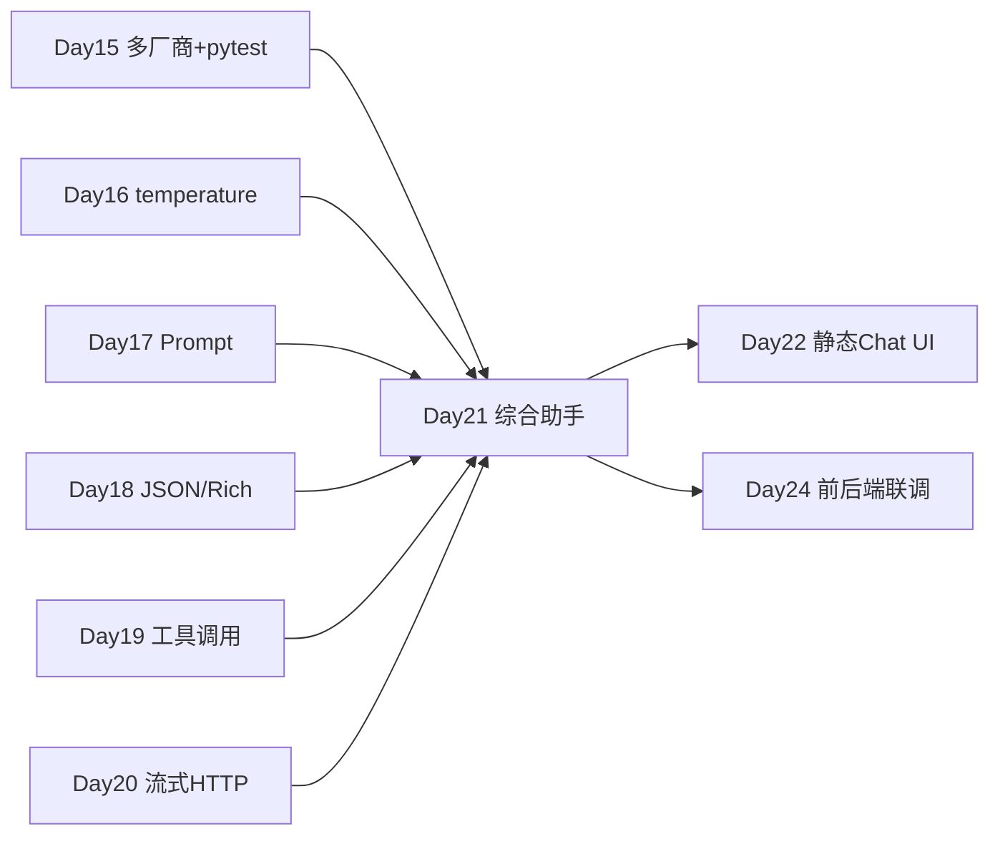

# Day 21 · Week 3 阶段测验 · 多轮 + 工具调用 + 流式综合实战

> **旁白（讲师口吻）**  
> 周五上午，张工在群里发了一行字：*「Week 3 结业考不是选择题——把 Day 15–20 学过的 **多轮上下文、工具调用、流式输出** 全部串进一个 `integrated_assistant.py`，下午 QA 要跑通 mock 演示。」*  
> 小陈补充：*「设计部下周要静态原型，今天你们先把后端能力闭环；Day 22 前端同学会接你们的接口契约。」*

---

## 今日学习地图

| 时段 | 主题 | 产出物 |
|------|------|--------|
| 09:00–10:00 | Week 3 知识回顾测验 | `code/week3_review_quiz.md` |
| 10:00–10:30 | 测验讲评 & 薄弱点梳理 | 讲师白板 |
| 10:30–12:00 | 综合架构拆解 | `03_架构与设计.md` |
| 14:00–16:30 | **主实战**：`integrated_assistant.py` | 多轮 + tools + streaming |
| 16:30–17:00 | `verify_day21.py` 验收 & mock 演示 | 全绿截图 |
| 17:00–17:30 | Week 3 复盘 & Day 22 预习 | `06_课后作业.md` |
| 19:00–21:00 | 错题订正 / 选做扩展 | `homework/day21/` |

## 与前后课程的衔接



| 前序能力 | 今日综合用法 |
|----------|--------------|
| Day 14/15 多轮 `messages` | `ConversationSession` 维护上下文 |
| Day 16 `temperature` | 可配置生成参数 |
| Day 17 系统 Prompt | `SYSTEM_PROMPT` + 工具说明注入 |
| Day 19 Function Calling | `ToolRegistry` + mock 工具执行环 |
| Day 20 流式 SSE | `stream_chat()` 生成器逐 token 输出 |

## 今日文件清单

| 文件 | 用途 |
|------|------|
| [01_业务背景.md](./01_业务背景.md) | Week 3 结业考与 QA 验收背景 |
| [02_需求文档.md](./02_需求文档.md) | 综合助手 PRD |
| [03_架构与设计.md](./03_架构与设计.md) | 模块图、工具环、流式数据流 |
| [04_课堂讲义.md](./04_课堂讲义.md) | **主课**（测验 + 综合编码） |
| [05_流程图与示意图.md](./05_流程图与示意图.md) | Agent 工具环、流式时序 |
| [06_课后作业.md](./06_课后作业.md) | 错题订正 + 扩展作业 |
| [07_作业参考答案.md](./07_作业参考答案.md) | 测验答案与讲评 |
| [08_补充讲义_Week3知识图谱.md](./08_补充讲义_Week3知识图谱.md) | Day 15–20 速查 |
| [code/week3_review_quiz.md](./code/week3_review_quiz.md) | **Week 3 测验题** |
| [code/integrated_assistant.py](./code/integrated_assistant.py) | **综合助手主程序** |
| [code/verify_day21.py](./code/verify_day21.py) | 自动化验收 |
| [code/requirements.txt](./code/requirements.txt) | 依赖 |
| [code/.env.example](./code/.env.example) | 环境变量模板 |
| [run.sh](./run.sh) | 一键启动 |

## 今日验收标准

- [ ] 完成 `week3_review_quiz.md` 测验，正确率 ≥ 80%  
- [ ] 无 API Key 时 `python3 integrated_assistant.py` 进入 mock REPL  
- [ ] 支持多轮对话，上下文至少保留最近 20 条消息  
- [ ] 用户问「北京天气」时触发 `get_weather` 工具并流式回复  
- [ ] `/stream on|off` 切换流式/整段输出  
- [ ] `/tools` 列出已注册工具；`/clear` 清空会话  
- [ ] `python3 verify_day21.py` 全部 `[OK]`  
- [ ] Git commit message 含 `day21`

## 快速开始

```bash
cd day21
bash run.sh                    # 创建 venv、安装依赖、启动助手
# 或
cd day21/code
pip install -r requirements.txt
cp .env.example .env           # 可选
python3 integrated_assistant.py
python3 verify_day21.py
```

交互示例：

```text
你> 查一下上海天气
助手> [streaming] 上海当前天气：晴，26°C，湿度 58%。（数据来源：mock_weather_api）

你> 订单 ST-10086 状态
助手> [streaming] 订单 ST-10086：已发货，预计 2026-07-08 送达。

你> /tools
已注册工具：get_weather, calc, lookup_order

你> /exit
```

---

**讲师提醒**：今日重点是 **模式汇合**——多轮、工具、流式在 Day 15–20 分头学过，今天证明你能在一个进程里编排它们。mock 优先闭环，有 Key 的同学可切 live 模式加分。

**状态**：✅ Day 21 Week 3 综合测验完整课件已发布
