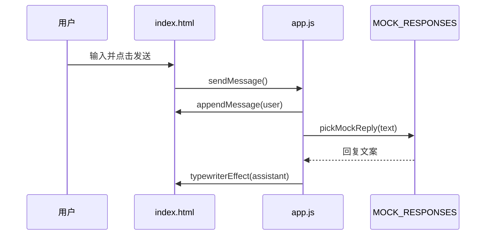

# Day 22 架构与设计 · 静态 Chat 页面与 Day 24 契约

## 1. 页面结构

```text
┌─────────────────────────────────────────────┐
│ header.app-header                           │
│   logo + title + btn-clear                  │
├─────────────────────────────────────────────┤
│ main#message-list.chat-messages             │
│   ┌─────────────────────┐                   │
│   │ .message.assistant  │                   │
│   └─────────────────────┘                   │
│                   ┌─────────────────────┐   │
│                   │ .message.user       │   │
│                   └─────────────────────┘   │
│         （flex:1, overflow-y:auto）          │
├─────────────────────────────────────────────┤
│ footer.chat-input-bar                       │
│   textarea#user-input + button#btn-send     │
└─────────────────────────────────────────────┘
```

## 2. 数据流（Day 22 mock）



## 3. Day 24 联调契约（今日仅注释）

### 3.1 请求

```http
POST /api/chat
Content-Type: application/json

{
  "message": "查上海天气",
  "session_id": "web-demo-001",
  "stream": false
}
```

### 3.2 响应（非流式）

```json
{
  "reply": "上海当前天气：晴，26°C...",
  "session_id": "web-demo-001",
  "tools_used": ["get_weather"]
}
```

### 3.3 app.js 切换点

```javascript
const USE_MOCK = true;  // Day 24 改为 false
const API_BASE = '';    // Day 24 改为 'http://127.0.0.1:8000'

async function sendMessage() {
  // ...
  if (USE_MOCK) {
    await mockReply(text);
  } else {
    const data = await fetchChat(text);
    await typewriterEffect(appendMessage('assistant', ''), data.reply);
  }
}
```

## 4. CSS 架构

| 类名 | 职责 |
|------|------|
| `.app` | 全屏 column 容器 |
| `.chat-messages` | 滚动消息区 |
| `.message` | 单条消息行 |
| `.message.user` | 右对齐气泡 |
| `.message.assistant` | 左对齐气泡 |
| `.bubble` | 圆角背景 |
| `.chat-input-bar` | 底部输入区 |

CSS 变量：

```css
:root {
  --primary: #2563eb;
  --bg: #f8fafc;
  --user-bubble: #2563eb;
  --assistant-bubble: #e2e8f0;
}
```

## 5. JS 模块划分（单文件）

```text
app.js
├── 配置 USE_MOCK / API_BASE
├── MOCK_RESPONSES + pickMockReply()
├── DOM 工具 appendMessage / scrollToBottom
├── typewriterEffect()
├── sendMessage() / clearChat()
├── fetchChat()  ← Day 24 启用
└── initEventListeners()
```

## 6. 与 Day 21 文案对齐

| Day 21 CLI 输出 | Day 22 mock |
|-----------------|-------------|
| 上海当前天气：晴，26°C... | 同句式 |
| 订单 ST-10086：已发货... | 同句式 |
| [mock] 已收到... | 默认兜底 |

设计部可直接从 Day 21 `demo_transcript.txt` 复制文案到 `MOCK_RESPONSES`。

## 7. 本地预览

```bash
# preview.sh
python3 -m http.server 8080 --directory static
```

`file://` 打开时：

- DOM 操作正常  
- Day 24 `fetch` 会因 CORS/协议失败 → 必须用 HTTP 服务  

## 8. 扩展点

| 扩展 | 文件 | Day |
|------|------|-----|
| SSE 流式 | `app.js` EventSource | 24+ |
| localStorage 会话 | `app.js` | 选做 |
| 组件化 | 拆 `chat.js` | 25 |
| Tailwind | 替换 `style.css` | 选做 |

---

**架构结论**：三文件分离关注点；Day 24 仅切换 `USE_MOCK` 与实现 `fetchChat`，HTML/CSS 可不动。
