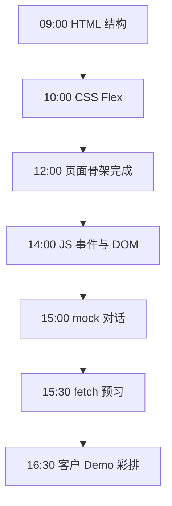
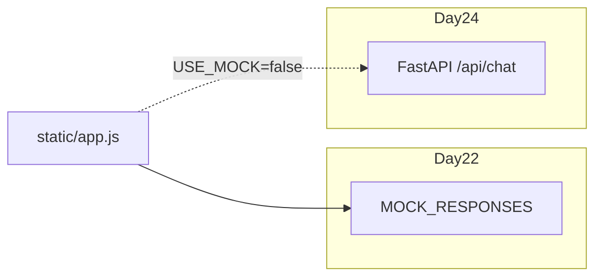

# Day 22 流程图与示意图

## 1. 一日学习流程



## 2. 页面布局 ASCII

```text
+------------------------------------------+
|  [星] 星火智服          [ 清空 ]         |
+------------------------------------------+
|                                          |
|  +------------------+                    |
|  | 您好，我是...    |  assistant        |
|  +------------------+                    |
|                    +------------------+  |
|                    | 查上海天气       |  user
|                    +------------------+  |
|  +------------------+                    |
|  | 上海当前...      |  assistant        |
|  +------------------+                    |
|              (scroll)                    |
+------------------------------------------+
|  [ 输入消息...              ] [ 发送 ]   |
+------------------------------------------+
```

## 3. sendMessage 流程

```text
sendMessage()
    │
    ├─ 读取 input，trim
    ├─ 空？→ return
    ├─ appendMessage('user', text)
    ├─ 清空 input
    │
    ├─ USE_MOCK === true ?
    │       ├─ yes → pickMockReply → typewriterEffect
    │       └─ no  → fetchChat → typewriterEffect  (Day 24)
    └─ scrollToBottom
```

## 4. Day 22 → Day 24 演进



## 5. 文件依赖

```text
index.html
    ├── link → style.css
    └── script → app.js
            ├── getElementById('message-list')
            ├── getElementById('user-input')
            └── getElementById('btn-send')
```

## 6. 响应式断点

```text
viewport > 480px     bubble max-width: 75%
viewport ≤ 480px     bubble max-width: 88%
                     header padding 缩小
```

---

**讲师提示**：白板画 **数据流** 即可，不必画每个 CSS 属性。
