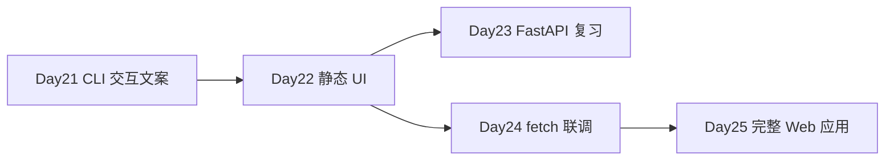

# Day 22 · 前端速成 · 静态 Chat 原型（客户 Demo）

> **旁白（讲师口吻）**  
> 周一早上，设计部 Lisa 在飞书 @ 全体：*「下午 3 点要给客户演示星火智服界面——后端 Day 24 才联调，今天先交 **静态 HTML 原型**，要能打字、能出字、样式像真产品。」*  
> 张工回复：*「Day 21 的 CLI 交互当文案参考；`static/` 里 `index.html` + `style.css` + `app.js`，**先 mock，不写后端**。」*

---

## 今日学习地图

| 时段 | 主题 | 产出物 |
|------|------|--------|
| 09:00–10:30 | HTML 语义与结构 | `static/index.html` 骨架 |
| 10:30–12:00 | CSS 布局与品牌色 | `static/style.css` |
| 14:00–15:30 | JS DOM + 事件 + mock 对话 | `static/app.js` |
| 15:30–16:30 | `fetch` 预习（注释占位，Day 24 启用） | `app.js` 内 `API_BASE` |
| 16:30–17:00 | 客户 Demo 彩排 & 截图 | 浏览器全屏截图 |
| 19:00–21:00 | 作业：响应式 + 无障碍 | `06_课后作业.md` |

## 与前后课程的衔接



| 前序能力 | 今日用法 |
|----------|----------|
| Day 21 工具回复格式 | `MOCK_RESPONSES` 文案来源 |
| Day 12 HTTP 概念 | `fetch` 预习注释 |
| Day 20 SSE | Day 24 流式 UI 预留 `stream` 参数 |

## 今日文件清单

| 文件 | 用途 |
|------|------|
| [01_业务背景.md](./01_业务背景.md) | 设计部客户 Demo deadline |
| [02_需求文档.md](./02_需求文档.md) | 静态原型 PRD |
| [03_架构与设计.md](./03_架构与设计.md) | 页面结构、状态、Day 24 契约 |
| [04_课堂讲义.md](./04_课堂讲义.md) | **主课** HTML/CSS/JS |
| [05_流程图与示意图.md](./05_流程图与示意图.md) | 数据流、联调时序 |
| [06_课后作业.md](./06_课后作业.md) | 响应式与 a11y |
| [07_作业参考答案.md](./07_作业参考答案.md) | 参考答案 |
| [08_补充讲义_前端调试与DevTools.md](./08_补充讲义_前端调试与DevTools.md) | Chrome DevTools |
| [static/index.html](./static/index.html) | **Chat 页面结构** |
| [static/style.css](./static/style.css) | **样式** |
| [static/app.js](./static/app.js) | **交互 + mock（无后端）** |
| [preview.sh](./preview.sh) | 本地静态服务器 |

## 今日验收标准

- [ ] 浏览器打开 `static/index.html` 可见星火智服品牌 Chat 界面  
- [ ] 输入消息点击发送（或 Enter）后，用户气泡立即出现  
- [ ] 约 0.5s 后 assistant mock 回复出现（含打字机效果）  
- [ ] 空消息、纯空格不可发送  
- [ ] `/clear` 或界面「清空」按钮可重置对话  
- [ ] 移动端宽度 375px 布局不崩（基础响应式）  
- [ ] `app.js` 内 `API_BASE` 与 `fetchChat` 已注释预留 Day 24  
- [ ] Git commit message 含 `day22`

## 快速开始

```bash
cd day22
bash preview.sh
# 浏览器访问 http://127.0.0.1:8080
```

或直接双击打开 `static/index.html`（部分浏览器 `file://` 下 fetch 受限，推荐 `preview.sh`）。

---

**讲师提醒**：今日 **不要** 写 Python 后端；客户 Demo 要的是 **像真的** 静态壳。Day 24 只改 `app.js` 几行 `fetch` 即可联调。

**状态**：✅ Day 22 前端速成完整课件已发布
