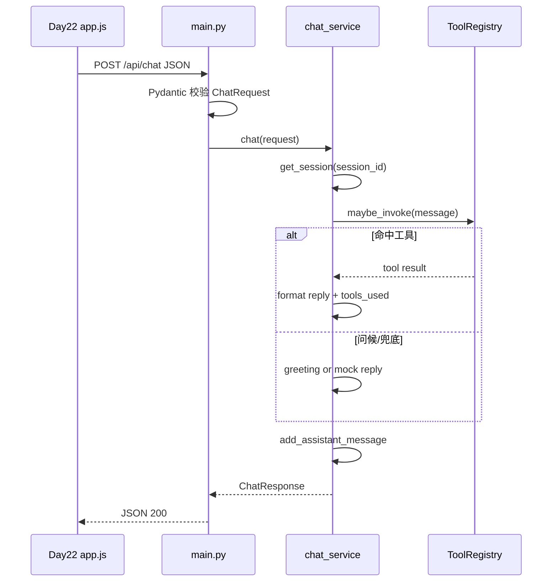
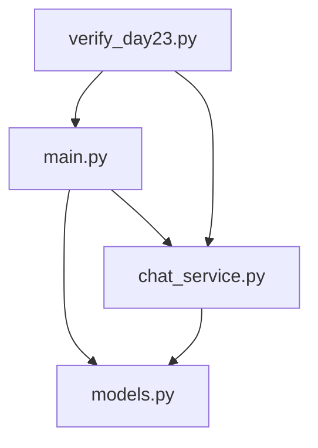

# Day 23 架构与设计 · FastAPI 分层与 Day 22 契约

## 1. 三层架构

```text
┌─────────────────────────────────────────────────────────┐
│  main.py          FastAPI 路由层                         │
│  - 参数解析、HTTP 状态码、CORS、response_model           │
├─────────────────────────────────────────────────────────┤
│  models.py        Pydantic 契约层                        │
│  - ChatRequest / ChatResponse / 校验规则                 │
├─────────────────────────────────────────────────────────┤
│  chat_service.py  业务层                                 │
│  - 会话存储、工具路由、mock/live LLM                     │
└─────────────────────────────────────────────────────────┘
```

**设计原则**：路由层不写业务逻辑；业务层不依赖 FastAPI 对象，便于 `verify_day23.py` 单测。

## 2. 请求时序（非流式）



## 3. Day 22 前端契约（冻结）

### 3.1 请求

```http
POST /api/chat
Content-Type: application/json

{
  "message": "查上海天气",
  "session_id": "web-demo-001",
  "stream": false
}
```

### 3.2 响应

```json
{
  "reply": "上海当前天气：晴，26°C...",
  "session_id": "web-demo-001",
  "tools_used": ["get_weather"]
}
```

### 3.3 前端切换点（day22/static/app.js）

```javascript
const USE_MOCK = false;  // Day 23 联调时改为 false
const API_BASE = 'http://127.0.0.1:8000';

const data = await fetchChat(text);
await typewriterEffect(bubble, data.reply || '');
```

## 4. FastAPI 教学路由设计

| 路由 | 教学点 |
|------|--------|
| `GET /` | 最简 JSON 返回 |
| `GET /health` | `response_model` 与运维探活 |
| `GET /items/{item_id}?q=` | 路径参数 `item_id: int` + `Query` |
| `POST /api/chat` | 请求体 `ChatRequest` + 响应 `ChatResponse` |

访问 `/docs` 时，FastAPI 根据类型注解 **自动生成 OpenAPI**，无需手写 Swagger。

## 5. Pydantic v2 校验流

```text
JSON body → ChatRequest.model_validate()
    ├─ 类型错误 / 缺字段 → FastAPI 自动 422 + detail 数组
    ├─ @field_validator 空白 message → ValueError → 422
    └─ 通过 → ChatRequest 实例传入 chat_service
```

422 响应示例：

```json
{
  "detail": [
    {
      "type": "value_error",
      "loc": ["body", "message"],
      "msg": "Value error, message 不能为空白",
      "input": "   "
    }
  ]
}
```

## 6. 会话存储（内存版）

```python
_sessions: dict[str, ConversationSession] = {}
```

| 操作 | 行为 |
|------|------|
| 新 `session_id` | 创建空会话（含 system prompt） |
| 每轮 chat | append user + assistant |
| 超过 20 条 | 保留 system + 最近 N 条 |
| DELETE `/sessions/{id}` | 清空该会话 |

**生产扩展**：Redis / PostgreSQL；今日教学用 dict 足够。

## 7. CORS 架构

```text
浏览器页面  http://127.0.0.1:8080  (day22 preview.sh)
       │
       │ fetch POST /api/chat
       ▼
API 服务    http://127.0.0.1:8000  (day23 uvicorn)
```

无 CORS 中间件时，浏览器 **拦截** 跨域响应（即使 curl 正常）。  
`CORSMiddleware` 在响应头加入 `Access-Control-Allow-Origin`。

## 8. mock 与 live 切换

| 条件 | 模式 |
|------|------|
| `SPARKTECH_MOCK=1`（默认） | mock |
| 无 `OPENAI_API_KEY` | mock |
| `SPARKTECH_MOCK=0` + 有效 Key | live OpenAI |

mock 工具文案与 Day 21 `_format_tool_reply`、Day 22 `MOCK_RESPONSES` **句式对齐**。

## 9. 模块依赖图



## 10. 扩展点

| 扩展 | 位置 | Day |
|------|------|-----|
| SSE `/api/chat/stream` | `main.py` | 24 |
| Redis 会话 | `chat_service.py` | 25+ |
| API Key 鉴权 | `main.py` Depends | 选做 |
| 限流 | 中间件 | 选做 |

---

**架构结论**：`models.py` 是前后端 **唯一契约源**；改字段必须同时改 Day 22 `app.js` 与 `verify_day23.py`。
