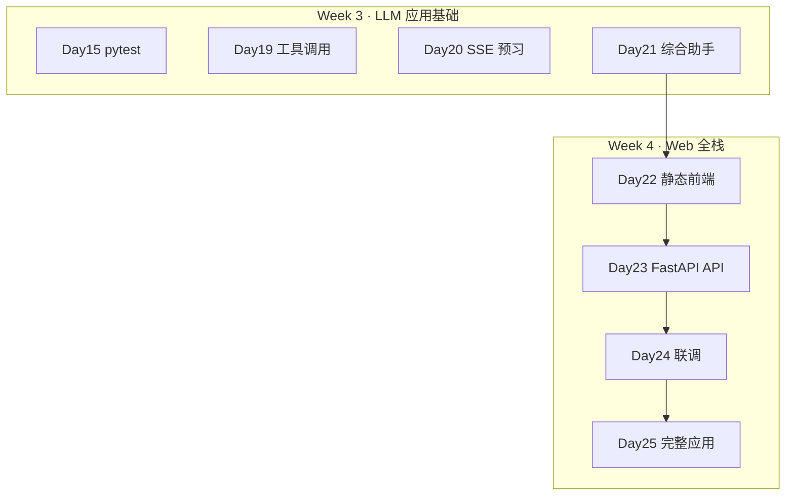
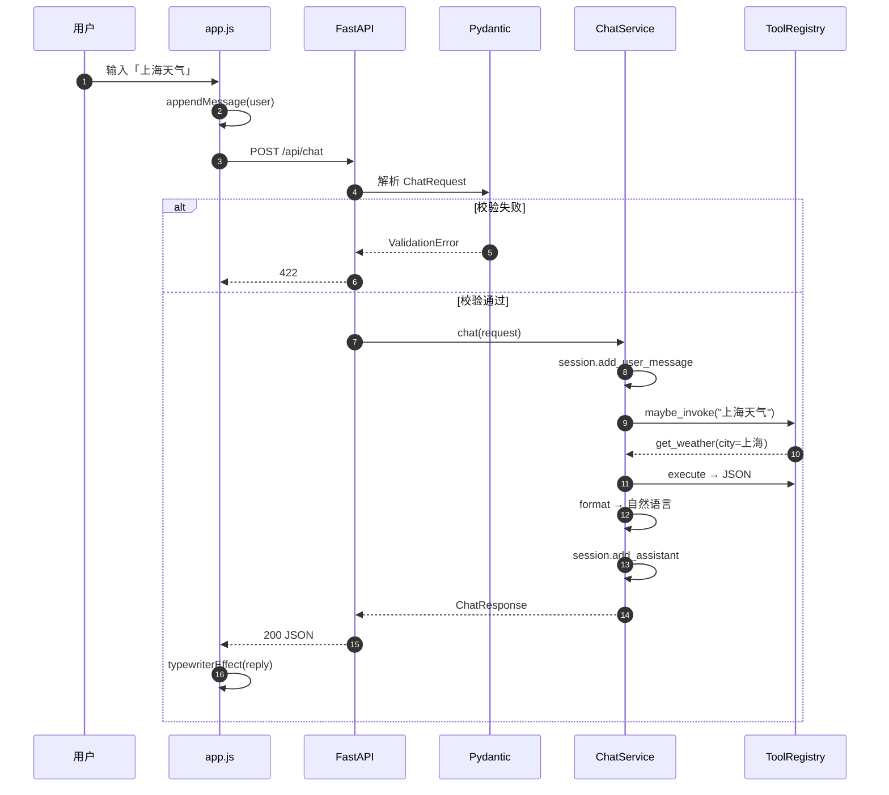
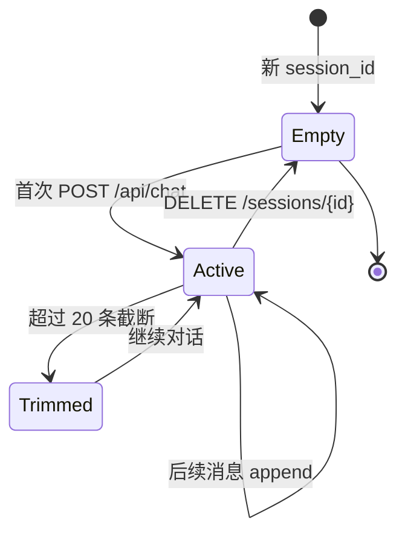
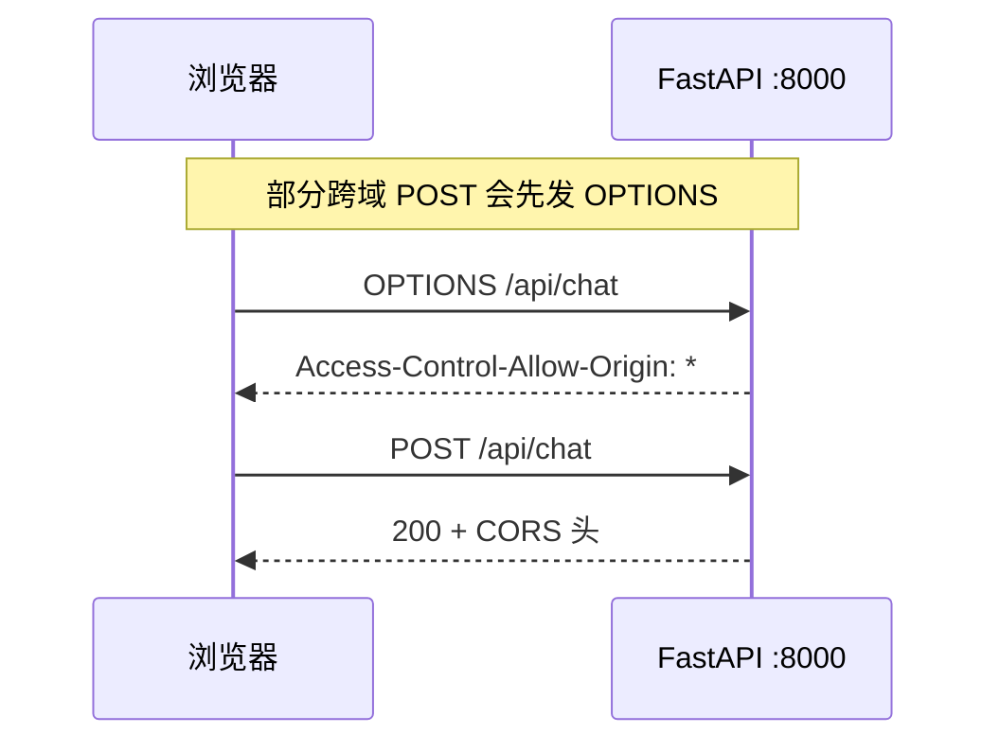

# Day 23 流程图与示意图

## 1. 课程在 70 天路线图中的位置



## 2. 系统组件图

```text
                    ┌──────────────────┐
                    │  day22/static/   │
                    │  index.html      │
                    │  app.js fetch    │
                    └────────┬─────────┘
                             │ HTTP POST JSON
                             ▼
                    ┌──────────────────┐
                    │  day23/code/     │
                    │  main.py :8000   │
                    │  CORSMiddleware  │
                    └────────┬─────────┘
                             │
              ┌──────────────┼──────────────┐
              ▼              ▼              ▼
        models.py    chat_service.py   /docs OpenAPI
        契约校验        会话+工具         自动文档
```

## 3. POST /api/chat 详细时序



## 4. Pydantic 校验流程

```text
  HTTP Body (bytes)
        │
        ▼
  json.loads()
        │
        ▼
  ChatRequest.model_validate()
        │
        ├─ 缺 message ──────────► 422 type=missing
        ├─ message 超长 ────────► 422 string_too_long
        ├─ message 全空白 ──────► 422 value_error
        │
        ▼
  ChatRequest 实例
        │
        ▼
  chat_service.chat()
```

## 5. 会话生命周期



## 6. mock 工具决策树

```text
用户 message
    │
    ├─ 含 ST-数字 或「订单」? ──► lookup_order
    │
    ├─ 含算术式 或「计算」? ────► calc
    │
    ├─ 含「天气/气温/温度」? ───► get_weather
    │
    ├─ 含「你好/hello」? ───────► 问候（无工具）
    │
    ├─ 含「帮助/help」? ────────► 帮助（无工具）
    │
    └─ 其他 ────────────────────► 默认兜底
```

## 7. CORS 预检（浏览器）



教学环境 `allow_origins=["*"]` 简化联调；生产应限制为前端域名。

## 8. 开发与联调双终端

```text
┌─ 终端 A ─────────────────────┐   ┌─ 终端 B ─────────────────────┐
│ cd day22                     │   │ cd day23                     │
│ bash preview.sh              │   │ bash run.sh                  │
│ → http://127.0.0.1:8080      │   │ → http://127.0.0.1:8000      │
└──────────────────────────────┘   └──────────────────────────────┘
              │                                    │
              └──────── fetch /api/chat ───────────┘
```

## 9. Day 24 流式扩展预留

```text
Day 23  POST /api/chat          stream=false  → 整段 reply
Day 24+ POST /api/chat/stream   stream=true   → SSE data: lines
```

今日 `stream: true` → HTTP 501，避免前端误以为流式已可用。

---

**图示结论**：Day 23 在架构上完成 **前端契约的后端实现**；数据流单向清晰，便于 Day 24 加流式分支而不破坏现有字段。
