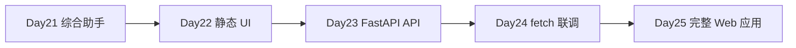

# Day 23 · FastAPI 入门 · Chat REST API（非流式）

> **旁白（讲师口吻）**  
> 周二早上，张工在飞书 @ 后端组：*「设计部 Day 22 静态页已经能演示了，客户问『数据是真的吗』——今天你们把 Day 21 的助手 **包成 HTTP API**，让前端明天能 `fetch`。」*  
> 小陈补充：*「先 **非流式** 跑通 `POST /api/chat`，字段跟 `day22/static/app.js` 里 `fetchChat` 一字不差；没 Key 就 mock，和 CLI 文案对齐。」*

---

## 今日学习地图

| 时段 | 主题 | 产出物 |
|------|------|--------|
| 09:00–10:30 | FastAPI 路由、路径/查询参数、自动文档 | `main.py` 教学路由 |
| 10:30–12:00 | Pydantic 模型、请求体验证、响应模型 | `models.py` |
| 14:00–15:30 | **主实战**：`chat_service.py` + `POST /api/chat` | mock 工具 + 会话 |
| 15:30–16:30 | CORS 与 Day 22 契约对齐 | `CORSMiddleware` |
| 16:30–17:00 | `verify_day23.py` 验收 & `/docs` 演示 | 全绿截图 |
| 19:00–21:00 | 作业：扩展路由与健康检查 | `06_课后作业.md` |

## 与前后课程的衔接



| 前序能力 | 今日用法 |
|----------|----------|
| Day 12 HTTP 概念 | REST 动词、JSON 请求体 |
| Day 20 FastAPI 预习 | 今日系统学习路由与文档 |
| Day 21 工具 mock 文案 | `chat_service.py` 关键词路由 |
| Day 22 `fetchChat` 契约 | `ChatRequest` / `ChatResponse` 字段对齐 |

## 今日文件清单

| 文件 | 用途 |
|------|------|
| [01_业务背景.md](./01_业务背景.md) | 后端交付 API 给前端联调 |
| [02_需求文档.md](./02_需求文档.md) | Chat API PRD |
| [03_架构与设计.md](./03_架构与设计.md) | 分层、契约、CORS |
| [04_课堂讲义.md](./04_课堂讲义.md) | **主课** FastAPI + Pydantic |
| [05_流程图与示意图.md](./05_流程图与示意图.md) | 请求时序、模块图 |
| [06_课后作业.md](./06_课后作业.md) | 路由扩展与联调预习 |
| [07_作业参考答案.md](./07_作业参考答案.md) | 参考答案 |
| [08_补充讲义_FastAPI排错与OpenAPI.md](./08_补充讲义_FastAPI排错与OpenAPI.md) | 422/CORS/OpenAPI 速查 |
| [code/main.py](./code/main.py) | **FastAPI 应用入口** |
| [code/models.py](./code/models.py) | **Pydantic 模型** |
| [code/chat_service.py](./code/chat_service.py) | **Chat 业务层** |
| [code/verify_day23.py](./code/verify_day23.py) | 自动化验收 |
| [code/requirements.txt](./code/requirements.txt) | 依赖 |
| [code/README.md](./code/README.md) | uvicorn 启动说明 |
| [run.sh](./run.sh) | 一键启动 |

## 今日验收标准

- [ ] `uvicorn main:app --reload` 可启动，访问 `/docs` 可见 Swagger  
- [ ] `GET /items/1?q=test` 返回路径参数与查询参数  
- [ ] `POST /api/chat` 请求体含 `message`、`session_id`、`stream`  
- [ ] 问「上海天气」返回含温度湿度，`tools_used` 含 `get_weather`  
- [ ] 问「ST-10086」返回订单状态，`tools_used` 含 `lookup_order`  
- [ ] 无 API Key 时 `python3 verify_day23.py` 全部 `[OK]`  
- [ ] CORS 已配置，Day 22 改 `USE_MOCK=false` 可联调  
- [ ] Git commit message 含 `day23`

## 快速开始

```bash
cd day23
bash run.sh
# 浏览器打开 http://127.0.0.1:8000/docs

# 或
cd day23/code
pip install -r requirements.txt
uvicorn main:app --reload --host 127.0.0.1 --port 8000
python3 verify_day23.py
```

curl 示例：

```bash
curl -s -X POST http://127.0.0.1:8000/api/chat \
  -H 'Content-Type: application/json' \
  -d '{"message":"你好","session_id":"web-demo-001","stream":false}'
```

---

**讲师提醒**：今日重点是 **契约稳定**——`reply`、`session_id`、`tools_used` 三个字段前端已经写死在 `app.js` 里。流式 SSE 明天 Day 24 再加，今天 `stream: true` 返回 501 是预期行为。

**状态**：✅ Day 23 FastAPI Chat API 完整课件已发布
