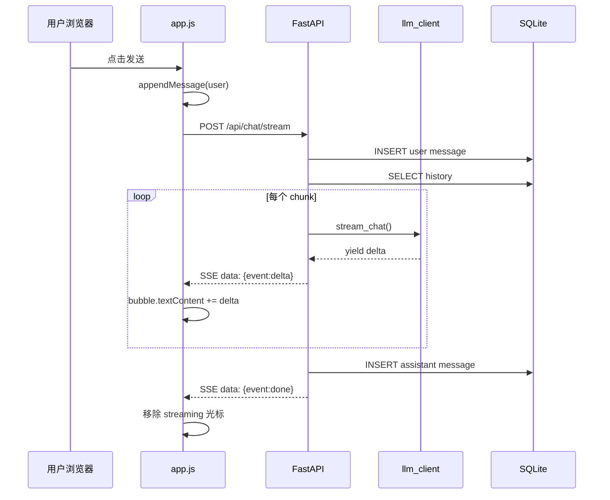

# Day 24 架构与设计 · 全栈 SSE Chat 系统

## 1. 系统总览

```text
┌─────────────────────────────────────────────────────────────┐
│                     Browser (port 8080)                      │
│  index.html + style.css + app.js                            │
│    │ fetch POST /api/chat/stream                            │
│    │ fetch GET  /api/sessions/{id}/history                  │
└────┼────────────────────────────────────────────────────────┘
     │ HTTP + CORS
     ▼
┌─────────────────────────────────────────────────────────────┐
│                  FastAPI Backend (port 8000)                 │
│  main.py ── CORS middleware                                 │
│  chat.py ── /api/chat, /api/chat/stream, history, clear     │
│  llm_client.py ── mock stream / live httpx stream           │
│  database.py + models.py ── SQLAlchemy ORM                  │
└────┼────────────────────────────────────────────────────────┘
     │
     ▼
┌─────────────────────────────────────────────────────────────┐
│              SQLite  day24/data/chat_history.db              │
│  chat_sessions │ chat_messages                              │
└─────────────────────────────────────────────────────────────┘
```

## 2. 后端模块职责

| 模块 | 职责 |
|------|------|
| `main.py` | App 工厂、CORS、lifespan 初始化 DB |
| `chat.py` | 路由、保存消息、组装 SSE |
| `llm_client.py` | mock 关键词 + live OpenAI 兼容流 |
| `models.py` | `ChatSession` `ChatMessage` ORM |
| `schemas.py` | Pydantic 请求/响应校验 |
| `database.py` | Engine、SessionLocal、`get_db` |

## 3. SSE 流式时序



## 4. 前端数据流

```text
localStorage.session_id
        │
        ▼
init() ──► GET /health ──► 状态徽章
        │
        ▼
     loadHistory() ──► 渲染历史气泡
        │
        ▼
sendMessage() ──► POST /api/chat/stream
        │
        ▼
parseSSEBuffer() ──► onDelta ──► DOM 追加
```

### 4.1 为何不用 EventSource

`EventSource` 仅支持 **GET**，无法 POST JSON body。  
本课使用 `fetch` + `ReadableStream` 读取 POST SSE，与 OpenAI 官方 SDK 做法一致。

## 5. session_id 策略

| 层级 | 策略 |
|------|------|
| 前端 | `localStorage` 键 `xinghuo_session_id`，首次访问生成 `web-{timestamp36}` |
| 后端 | 请求体 `session_id`，不存在则 `INSERT` session |
| DB | `chat_messages.session_id` 外键关联 |

## 6. mock 流式实现

```python
def _mock_stream(self, user_text: str) -> Iterator[str]:
    reply, _ = _mock_plan(user_text)
    for chunk in _chunk_text(reply, chunk_size=2):
        time.sleep(self._mock_chunk_delay_ms / 1000.0)
        yield chunk
```

要点：

- 先规划完整回复，再分块 yield  
- 块大小 2 字符，间隔 ~35ms，模拟打字感  
- `done` 事件时 assistant 全文已写入 DB  

## 7. CORS 配置

```python
app.add_middleware(
    CORSMiddleware,
    allow_origins=["http://127.0.0.1:8080", ...],
    allow_credentials=True,
    allow_methods=["*"],
    allow_headers=["*"],
)
```

环境变量 `CORS_ORIGINS` 逗号分隔，便于部署时修改。

## 8. 目录结构

```text
day24/
├── backend/
│   ├── main.py
│   ├── chat.py
│   ├── llm_client.py
│   ├── models.py
│   ├── schemas.py
│   └── database.py
├── frontend/
│   ├── index.html
│   ├── style.css
│   └── app.js
├── data/                  # 运行时生成
│   └── chat_history.db
├── requirements.txt
├── .env.example
├── run.sh
└── verify_day24.py
```

## 9. 与 Day 22 契约对照

| Day 22 预留 | Day 24 实现 |
|-------------|-------------|
| `API_BASE` | `http://127.0.0.1:8000` |
| `USE_MOCK = false` | 默认对接后端 |
| `fetchChat` 注释 | `fetchChatStream` 完整实现 |
| `SESSION_ID` 常量 | `localStorage` 动态 session |

## 10. 扩展点（作业）

1. `live` 模式：`OPENAI_API_KEY` + `httpx` stream 解析  
2. 会话列表：`GET /api/sessions`  
3. Nginx 反代：注意 SSE 禁用缓冲  

---

**设计评审**：张工 · 2026-07-06
