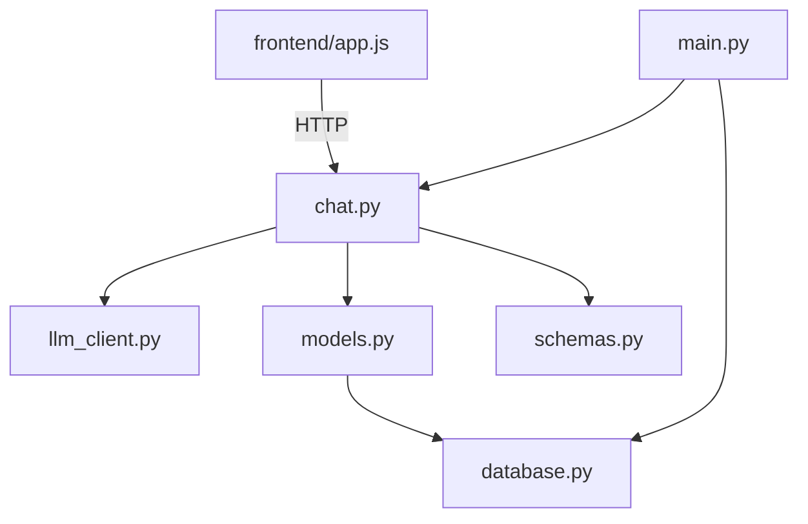
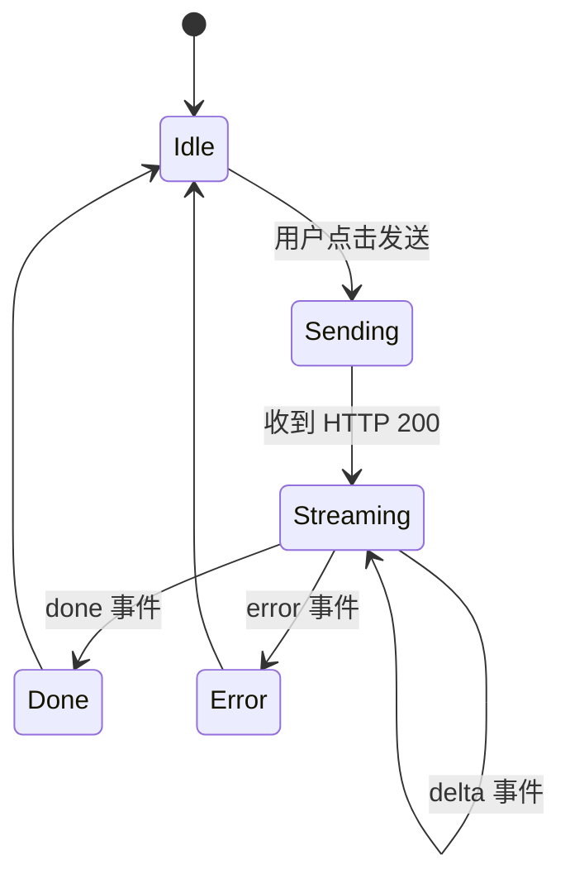
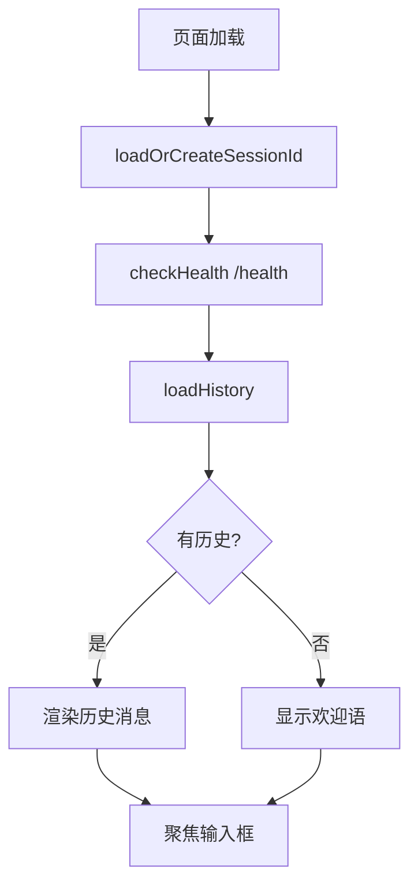
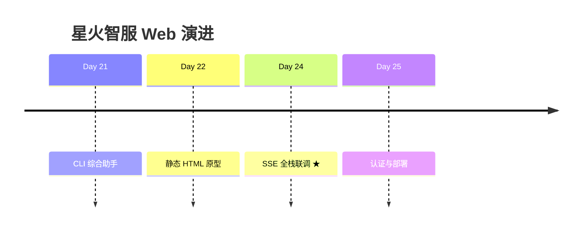

# Day 24 流程图与示意图

## 1. 部署拓扑

```text
                    ┌──────────────────┐
                    │   开发者本机      │
                    └────────┬─────────┘
                             │
              ┌──────────────┴──────────────┐
              │                             │
              ▼                             ▼
    ┌─────────────────┐         ┌─────────────────┐
    │ python -m       │         │ uvicorn         │
    │ http.server     │         │ backend.main    │
    │ :8080/frontend  │         │ :8000           │
    └────────┬────────┘         └────────┬────────┘
             │                           │
             │    CORS + POST SSE        │
             └───────────┬───────────────┘
                         ▼
                 ┌───────────────┐
                 │ chat_history  │
                 │    .db        │
                 └───────────────┘
```

## 2. 模块依赖图



## 3. 单次对话状态机



## 4. SSE 报文示例

```text
客户端 POST /api/chat/stream
        │
        ▼
服务端响应头
  Content-Type: text/event-stream
        │
        ▼
┌───────────────────────────────────────┐
│ data: {"event":"delta","delta":"上"}  │
│                                       │
│ data: {"event":"delta","delta":"海"}  │
│                                       │
│ data: {"event":"delta","delta":"当"}  │
│        ...                            │
│ data: {"event":"done","message_id":5} │
└───────────────────────────────────────┘
```

## 5. 数据库 ER 图

```text
┌─────────────────┐       ┌─────────────────┐
│  chat_sessions  │       │  chat_messages  │
├─────────────────┤       ├─────────────────┤
│ id (PK)         │───┐   │ id (PK)         │
│ title           │   └──►│ session_id (FK) │
│ created_at      │       │ role            │
│ updated_at      │       │ content         │
└─────────────────┘       │ tools_used      │
                          │ created_at      │
                          └─────────────────┘
```

## 6. 前端初始化流程



## 7. mock 关键词路由

```text
用户输入
    │
    ├─ 含「天气」──► get_weather 文案 + 流式分块
    ├─ 含「订单/ST-」► lookup_order 文案
    ├─ 含「你好」──► 问候语
    ├─ 含「帮助」──► 功能列表
    └─ 其他 ──────► 默认提示
```

## 8. 与课程主线衔接



---

**图示版本**：v1.0 · Day 24
