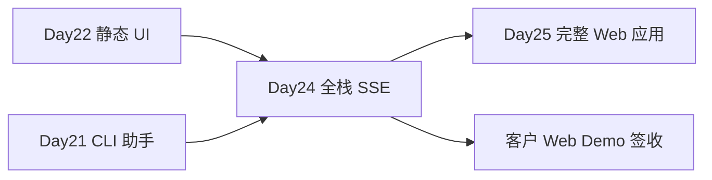

# Day 24 · Web ChatGPT Clone · 全栈 SSE 联调（KEY MILESTONE）

> **旁白（讲师口吻）**  
> 周三下午，产品小陈在会议室投屏：*「Day 22 的静态页客户很满意，但今天他们要 **真对话**——字要一个字一个字蹦出来，刷新页面历史还在。」*  
> 张工在白板上画了两条线：*「FastAPI SSE 推流 + SQLite 存会话；前端 `fetch` 读流。今天交付 **星火智服 Web Demo**，下午 4 点客户到场。」*

---

## 今日学习地图

| 时段 | 主题 | 产出物 |
|------|------|--------|
| 09:00–10:30 | SSE 原理与 FastAPI `StreamingResponse` | `backend/chat.py` |
| 10:30–12:00 | CORS + SQLAlchemy 会话持久化 | `database.py` `models.py` |
| 14:00–15:30 | 前端 `fetch` 读 SSE + 流式 UI | `frontend/app.js` |
| 15:30–16:30 | 客户 Demo 彩排 & `verify_day24.py` | 全链路验收 |
| 19:00–21:00 | 作业：live 模式 + 会话列表 | `06_课后作业.md` |

## 里程碑定位



**Day 24 是 Week 4 第一个 KEY MILESTONE**：前后端首次完整联调，具备可演示的 Web 产品形态。

## 今日文件清单

| 文件 | 用途 |
|------|------|
| [01_业务背景.md](./01_业务背景.md) | 客户 Web Demo 验收事件 |
| [02_需求文档.md](./02_需求文档.md) | 全栈 Chat PRD |
| [03_架构与设计.md](./03_架构与设计.md) | SSE / DB / 前端数据流 |
| [04_课堂讲义.md](./04_课堂讲义.md) | **主课** 后端 + 前端联调 |
| [05_流程图与示意图.md](./05_流程图与示意图.md) | 时序图、模块图 |
| [06_课后作业.md](./06_课后作业.md) | live 模式与会话管理扩展 |
| [07_作业参考答案.md](./07_作业参考答案.md) | 参考答案 |
| [08_补充讲义_SSE与CORS深入.md](./08_补充讲义_SSE与CORS深入.md) | SSE 协议与跨域排错 |
| [项目答辩评分标准.md](./项目答辩评分标准.md) | Web Demo 答辩 Rubric |
| [backend/](./backend/) | FastAPI + SSE + SQLite |
| [frontend/](./frontend/) | 流式 Chat UI |
| [run.sh](./run.sh) | 一键启动 |
| [verify_day24.py](./verify_day24.py) | 自动化验收 |

## 今日验收标准

- [ ] `bash run.sh` 后浏览器打开 `http://127.0.0.1:8080` 可见 Chat 界面  
- [ ] 发送「上海天气」后 assistant 回复 **逐字流式** 出现  
- [ ] 刷新页面后历史消息从 SQLite 加载  
- [ ] `session_id` 写入 `localStorage`，同一会话多轮上下文正确  
- [ ] 无 `OPENAI_API_KEY` 时 mock 模式可完整演示  
- [ ] `python3 verify_day24.py` 全部 `[OK]`  
- [ ] Network 面板可见 `text/event-stream` 响应  
- [ ] Git commit message 含 `day24`

## 快速开始

```bash
cd day24
bash run.sh
# 浏览器访问 http://127.0.0.1:8080
# API 文档   http://127.0.0.1:8000/docs
```

仅验收后端：

```bash
cd day24
python3 -m venv .venv && source .venv/bin/activate
pip install -r requirements.txt
python3 verify_day24.py
```

---

**讲师提醒**：今日重点是 **SSE 流式 + 会话持久化**，不是 UI 炫技。客户 Demo 脚本：天气 → 订单 → 刷新看历史 → 清空。

**状态**：✅ Day 24 Web ChatGPT Clone 完整课件已发布
