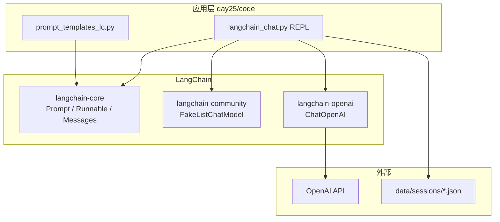
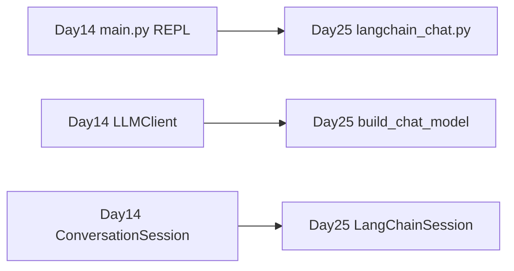
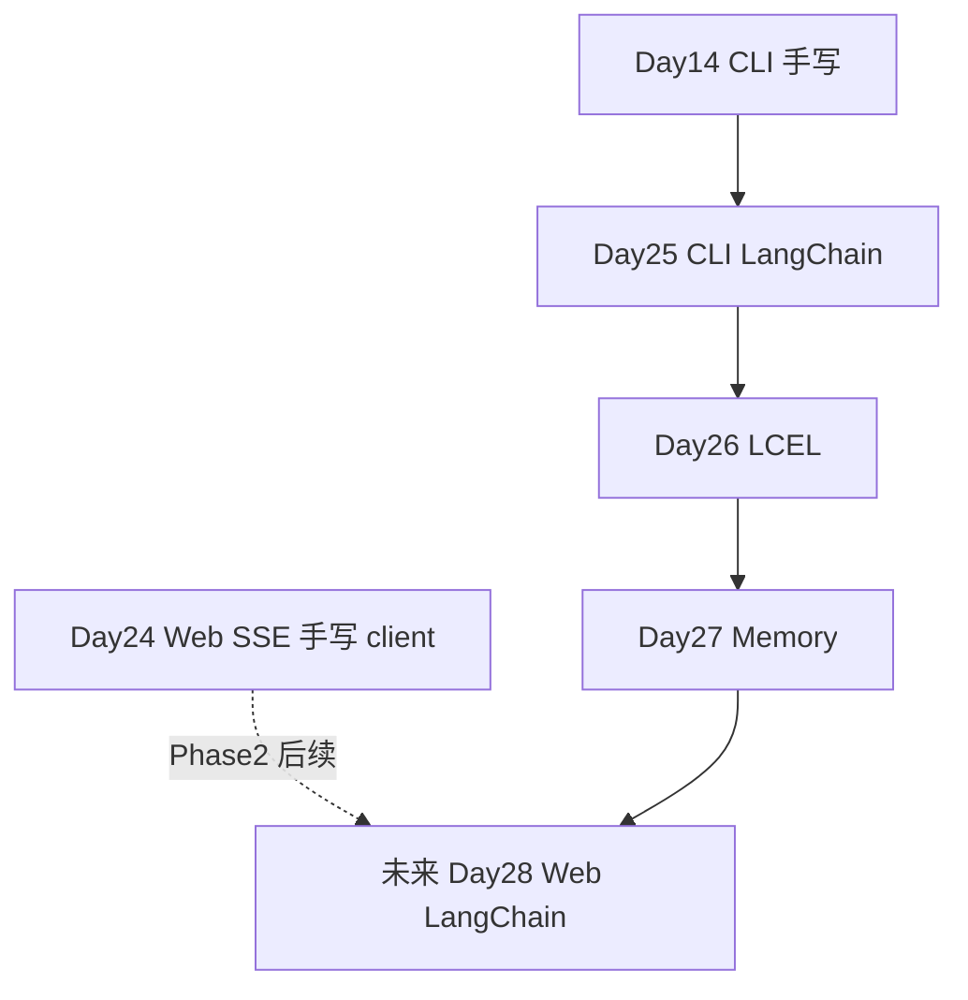

# Day 25 流程图与示意图

## 1. LangChain 生态分层



## 2. Day 14 → Day 25 迁移路径



## 3. 单轮对话时序

```sequenceDiagram
    participant U as 用户
    participant R as REPL
    participant S as LangChainSession
    participant P as ChatPromptTemplate
    participant L as ChatModel

    U->>R: 输入文本
    R->>S: add_user()
    R->>P: format_messages(history, user_input)
    P->>L: invoke(messages)
    L-->>R: AIMessage
    R->>S: add_assistant()
    R-->>U: 打印助手回复
```

## 4. Mock 模式判定

```text
                    ┌─────────────────┐
                    │ 启动 langchain  │
                    │ _chat.py        │
                    └────────┬────────┘
                             │
                    ┌────────▼────────┐
                    │ SPARKTECH_MOCK  │
                    │ = 1 ?           │
                    └────────┬────────┘
                         yes │ no
              ┌──────────────┼──────────────┐
              ▼              ▼              ▼
        FakeList      OPENAI_API_KEY    ChatOpenAI
        ChatModel      为空?              live
              │              │
              │         yes  │ no
              │              ▼
              └──────────────┴──► mock 模式
```

## 5. Prompt 消息结构

```text
┌──────────────────────────────────────┐
│ SystemMessage: 你是星火智服助手...    │
├──────────────────────────────────────┤
│ MessagesPlaceholder (history)        │
│   HumanMessage: 上一轮用户            │
│   AIMessage: 上一轮助手               │
│   ...                                │
├──────────────────────────────────────┤
│ HumanMessage: {user_input} 当前轮     │
└──────────────────────────────────────┘
           │
           ▼
      ChatModel.invoke()
```

## 6. 与 Day 24 Web 的位置关系


