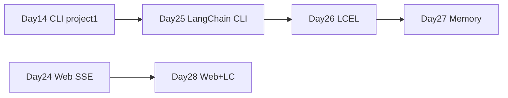

# Day 25 · LangChain 入门 · 架构与 ChatModel / PromptTemplate

> **旁白（讲师口吻）**  
> 周一早会，张工在白板上画了一条迁移线：*「Day 14 的 CLI 助手跑得很稳，但 Phase2 要统一技术栈——**全部迁到 LangChain**。今天先搞懂架构、`ChatModel`、`PromptTemplate`，把 `project1` 用 LCEL 前身重写一遍。」*  
> 小陈补充：*「Day 24 Web 先不动，今天专注 **CLI 迁移**；没 Key 就用 `FakeListChatModel`，验收脚本必须全绿。」*

---

## 今日学习地图

| 时段 | 主题 | 产出物 |
|------|------|--------|
| 09:00–10:00 | LangChain 架构与生态 | `01_业务背景.md` |
| 10:00–11:30 | ChatModel + PromptTemplate | `prompt_templates_lc.py` |
| 11:30–12:00 | mock 冒烟 | `python verify_day25.py` |
| 14:00–16:00 | **主实战**：重写 Day 14 CLI | `langchain_chat.py` |
| 16:00–17:00 | 与 Day 14 对照 Code Review | `03_架构与设计.md` |
| 19:00–21:00 | 作业：扩展 system 模板 | `06_课后作业.md` |

## 与前后课程的衔接



| 前序能力 | 今日用法 |
|----------|----------|
| [Day 14 `project1/`](../day14/project1/) | `langchain_chat.py` 功能对齐迁移 |
| [Day 14 `LLMClient`](../day14/project1/llm_client.py) | 替换为 `ChatOpenAI` / `FakeListChatModel` |
| [Day 14 `ConversationSession`](../day14/project1/session.py) | `LangChainSession` + LangChain Messages |
| [Day 24 Web Chat](../day24/) | Phase2 后续将后端迁入 LC（预习链接） |

## 今日文件清单

| 文件 | 用途 |
|------|------|
| [01_业务背景.md](./01_业务背景.md) | 星火智服 Phase2 LangChain 迁移背景 |
| [02_需求文档.md](./02_需求文档.md) | CLI 迁移 PRD |
| [03_架构与设计.md](./03_架构与设计.md) | LC 分层与 Day 14 对照 |
| [04_课堂讲义.md](./04_课堂讲义.md) | **主课** ChatModel + Prompt |
| [05_流程图与示意图.md](./05_流程图与示意图.md) | 架构图、数据流 |
| [06_课后作业.md](./06_课后作业.md) | 模板扩展作业 |
| [07_作业参考答案.md](./07_作业参考答案.md) | 参考答案 |
| [08_补充讲义_LangChain生态与版本.md](./08_补充讲义_LangChain生态与版本.md) | 包拆分与版本速查 |
| [code/langchain_chat.py](./code/langchain_chat.py) | **Day 14 LangChain 重写** |
| [code/prompt_templates_lc.py](./code/prompt_templates_lc.py) | 模板教学 |
| [code/verify_day25.py](./code/verify_day25.py) | 自动化验收 |
| [run.sh](./run.sh) | 一键启动 REPL |

## 今日验收标准

- [ ] `python3 code/verify_day25.py` 全部 `[OK]`  
- [ ] 无 API Key 时 `bash run.sh` 进入 mock REPL  
- [ ] `/help` `/clear` `/save` `/exit` 与 Day 14 行为一致  
- [ ] `ChatPromptTemplate` 含 `MessagesPlaceholder` 多轮历史  
- [ ] 能口述 LangChain 核心包职责（core / community / openai）  
- [ ] Git commit message 含 `day25`

## 快速开始

```bash
cd day25
bash run.sh
# 或
cd day25/code
pip install -r requirements.txt
python verify_day25.py
python langchain_chat.py
```

---

**讲师提醒**：今日重点是 **概念迁移**——先让学员看到 Day 14 每一行手写代码在 LangChain 里对应什么组件，明天再上 `|` 管道与 OutputParser。

**状态**：✅ Day 25 LangChain 入门完整课件已发布
