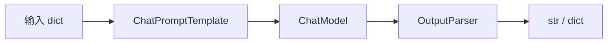

# Day 26 流程图与示意图

## 1. LCEL 管道



## 2. RunnableParallel

```mermaid
flowchart TB
    IN[输入 "星火智服"] --> PAR[RunnableParallel]
    PAR --> Q[question 分支 Passthrough]
    PAR --> L[length 分支 Lambda]
    PAR --> U[upper 分支 Lambda]
    Q --> MERGE[合并 dict]
    L --> MERGE
    U --> MERGE
```

## 3. translation_chain

```mermaid
flowchart LR
    D["{source_text, target_language}"] --> A[assign source_lang]
    A --> M{mock?}
    M -->|yes| F[RunnableLambda mock_translate]
    M -->|no| P[prompt | llm | StrOutputParser]
    F --> R[译文 str]
    P --> R
```

## 4. 课程进度

```text
Day25 ChatModel ──► Day26 LCEL ──► Day27 Memory ──► Web 统一栈
```
