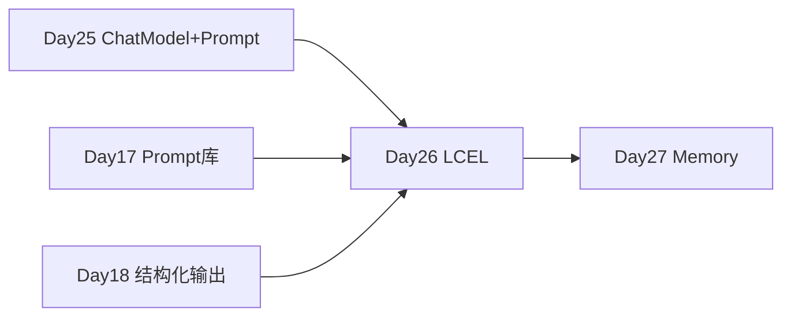

# Day 26 · LCEL · 管道符 | 与 OutputParser

> **旁白（讲师口吻）**  
> 周二上午，张工在 Day 25 的 CLI 代码上画了一个 `|`：*「别再用一堆临时变量拼链了——**LCEL** 才是 Phase2 标准写法。今天搞懂 `Runnable`、`StrOutputParser`、`RunnableParallel`，把翻译工单链写出来。」*  
> 小陈：*「验收脚本要覆盖 JSON 和 Pydantic 两种解析，mock 继续 `FakeListChatModel`。」*

---

## 今日学习地图

| 时段 | 主题 | 产出物 |
|------|------|--------|
| 09:00–10:00 | Runnable 与 LCEL 概念 | `01_业务背景.md` |
| 10:00–11:30 | `prompt \| llm \| parser` | `lcel_chain_demo.py` |
| 11:30–12:00 | OutputParser 三类 | Str / Json / Pydantic |
| 14:00–15:30 | **主实战**：翻译链 | `translation_chain.py` |
| 15:30–16:30 | RunnablePassthrough / Parallel | `lcel_chain_demo.py` |
| 16:30–17:00 | `verify_day26.py` 验收 | 全绿 |
| 19:00–21:00 | 作业 | `06_课后作业.md` |

## 与前后课程的衔接



| 前序能力 | 今日用法 |
|----------|----------|
| [Day 25 LangChain 入门](../day25/) | `build_chat_model`、Prompt 模板 |
| [Day 17 Prompt 库](../day17/) | 翻译模板迁入 LCEL |
| [Day 18 结构化输出](../day18/) | `JsonOutputParser` / Pydantic |
| [Day 14 CLI](../day14/) | 明日 Memory 接回多轮对话 |

## 今日文件清单

| 文件 | 用途 |
|------|------|
| [01_业务背景.md](./01_业务背景.md) | Phase2 链式重构背景 |
| [02_需求文档.md](./02_需求文档.md) | LCEL 实验 PRD |
| [03_架构与设计.md](./03_架构与设计.md) | Runnable 组合模式 |
| [04_课堂讲义.md](./04_课堂讲义.md) | **主课** |
| [05_流程图与示意图.md](./05_流程图与示意图.md) | 管道图 |
| [06_课后作业.md](./06_课后作业.md) | 作业 |
| [07_作业参考答案.md](./07_作业参考答案.md) | 参考答案 |
| [08_补充讲义_LCEL进阶与调试.md](./08_补充讲义_LCEL进阶与调试.md) | stream/batch 补充 |
| [code/lcel_chain_demo.py](./code/lcel_chain_demo.py) | LCEL 综合演示 |
| [code/translation_chain.py](./code/translation_chain.py) | 翻译业务链 |
| [code/verify_day26.py](./code/verify_day26.py) | 验收 |

## 今日验收标准

- [ ] `python3 code/verify_day26.py` 全部 `[OK]`  
- [ ] 能解释 `prompt | llm | StrOutputParser` 数据流  
- [ ] `JsonOutputParser` 与 Pydantic 解析成功  
- [ ] `RunnableParallel` 输出含多字段 dict  
- [ ] `translation_chain.py` 英/日翻译 mock 可运行  
- [ ] Git commit message 含 `day26`

## 快速开始

```bash
cd day26
bash run.sh
cd day26/code && python verify_day26.py
```

---

**讲师提醒**：LCEL 的核心是 **声明式组合**——学员要能画出每一节的输入输出类型。

**状态**：✅ Day 26 LCEL 完整课件已发布
