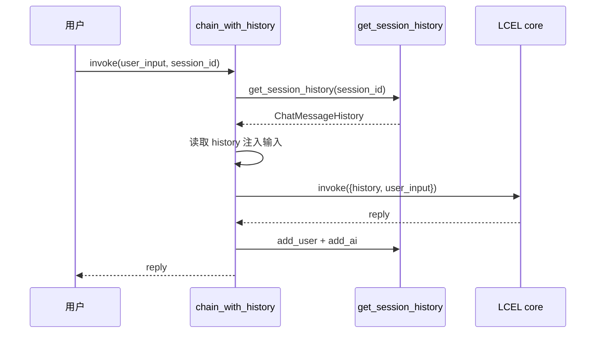
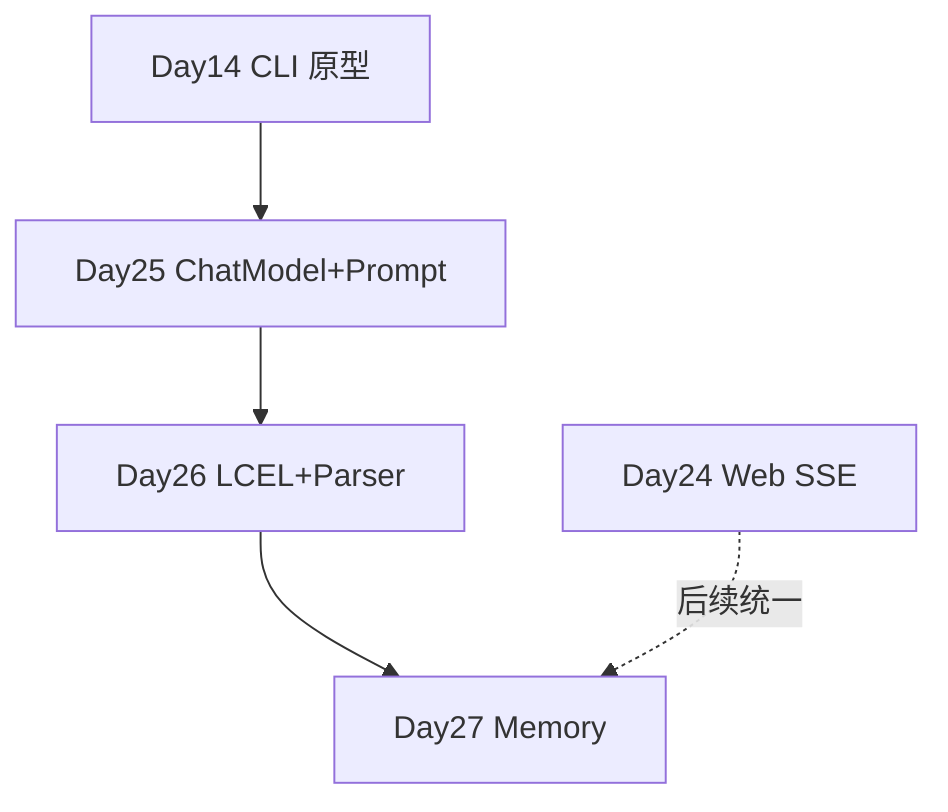

# Day 27 流程图与示意图

## 1. RunnableWithMessageHistory 时序



## 2. Memory 模式切换

```text
SPARKTECH_MEMORY_MODE
        │
   ┌────┼────┬────────┐
   ▼    ▼    ▼        ▼
memory window summary sqlite
   │    │    │        │
   └────┴────┴────────┴──► ChatMessageHistory 子类 / SQL 实现
```

## 3. Phase2 技术栈总览



## 4. Session 隔离

```text
session-a ──► History A (独立 messages)
session-b ──► History B (独立 messages)
```

`configurable.session_id` 是隔离键。
