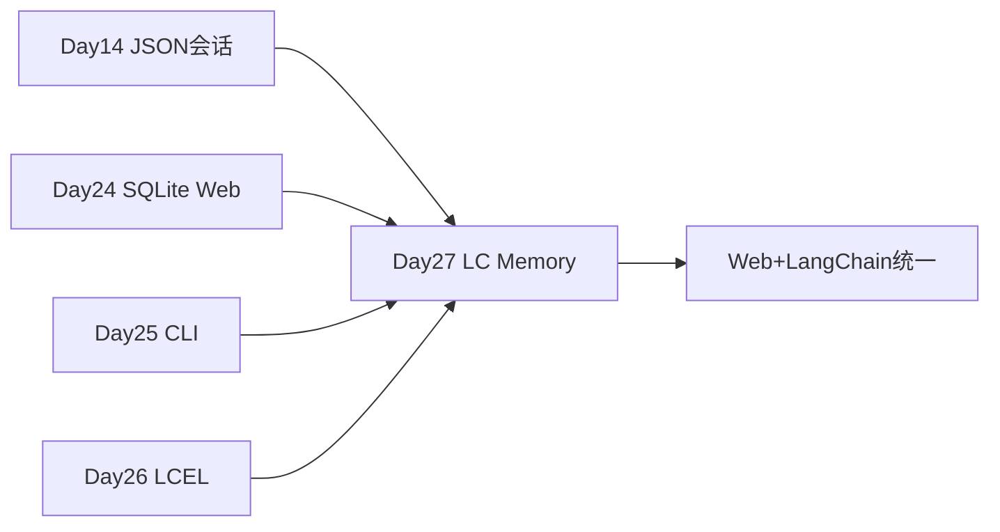

# Day 27 · Memory · ChatMessageHistory 与 RunnableWithMessageHistory

> **旁白（讲师口吻）**  
> 周三下午，张工指着 Day 25 CLI：*「链有了，但多轮历史还在自己拼 `history` 列表——**Memory 层**要交给 LangChain。今天搞懂 `ChatMessageHistory`、`RunnableWithMessageHistory`，以及窗口 / 摘要 / SQLite 三种策略。」*  
> 小陈：*「要能和 [Day 24 Web](../day24/) 的 SQLite 会话表概念对齐，CLI 先跑通。」*

---

## 今日学习地图

| 时段 | 主题 | 产出物 |
|------|------|--------|
| 09:00–10:00 | Memory 概念与分类 | `01_业务背景.md` |
| 10:00–11:30 | ChatMessageHistory | `memory_demo.py` |
| 11:30–12:00 | RunnableWithMessageHistory | `session_memory_chat.py` |
| 14:00–15:00 | Window / Summary 策略 | `memory_demo.py` |
| 15:00–16:00 | SQLite 持久化 | `SQLChatMessageHistory` |
| 16:00–17:00 | `verify_day27.py` | 全绿 |
| 19:00–21:00 | 作业 | `06_课后作业.md` |

## 与前后课程的衔接



| 前序能力 | 今日用法 |
|----------|----------|
| [Day 25 LangChain CLI](../day25/) | 链 + Memory 包装 |
| [Day 26 LCEL](../day26/) | `prompt \| llm \| parser` 接 History |
| [Day 14 会话 JSON](../day14/project1/storage.py) | 对比 LC 自动读写 history |
| [Day 24 SQLite](../day24/backend/database.py) | Web 持久化概念对齐 |

## 今日文件清单

| 文件 | 用途 |
|------|------|
| [01_业务背景.md](./01_业务背景.md) | Phase2 Memory 迁移 |
| [02_需求文档.md](./02_需求文档.md) | Memory PRD |
| [03_架构与设计.md](./03_架构与设计.md) | 三种 Memory 策略 |
| [04_课堂讲义.md](./04_课堂讲义.md) | **主课** |
| [05_流程图与示意图.md](./05_流程图与示意图.md) | 时序图 |
| [06_课后作业.md](./06_课后作业.md) | 作业 |
| [07_作业参考答案.md](./07_作业参考答案.md) | 参考答案 |
| [08_补充讲义_Memory策略选型.md](./08_补充讲义_Memory策略选型.md) | 选型指南 |
| [code/memory_demo.py](./code/memory_demo.py) | Memory 模式演示 |
| [code/session_memory_chat.py](./code/session_memory_chat.py) | **带记忆 CLI** |
| [code/verify_day27.py](./code/verify_day27.py) | 验收 |

## 今日验收标准

- [ ] `python3 code/verify_day27.py` 全部 `[OK]`  
- [ ] `RunnableWithMessageHistory` 多轮后 history ≥ 4 条  
- [ ] Window 模式仅保留最近 k 对消息  
- [ ] SQLite 重载后会话仍在  
- [ ] `/session` 切换会话互不影响  
- [ ] Git commit message 含 `day27`

## 快速开始

```bash
cd day27
bash run.sh
cd day27/code && python verify_day27.py
```

---

**讲师提醒**：Memory 的核心是 **session_id → ChatMessageHistory 工厂**；Web 层只需传同一个 `session_id`。

**状态**：✅ Day 27 Memory 完整课件已发布
