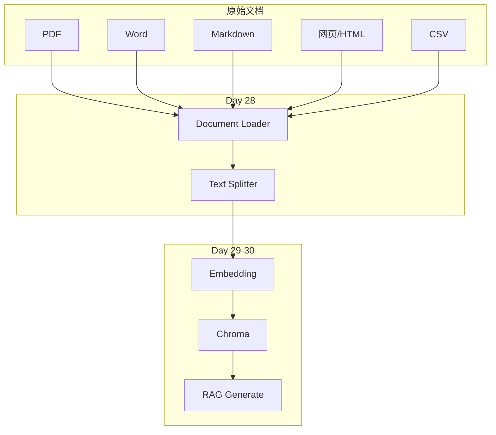
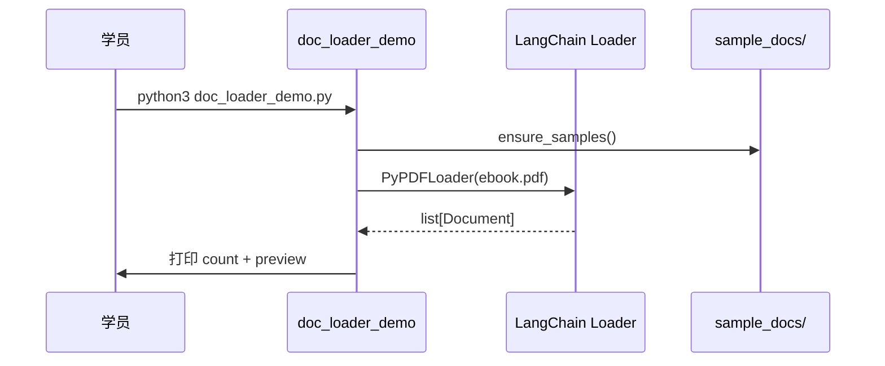

# Day 28 流程图与示意图

## 1. RAG 文档链总览（Day 28 段）



## 2. doc_loader_demo 时序



## 3. Splitter 决策树（Recursive）

```text
                    输入长文本
                         │
                         ▼
              按 chunk_size 尝试切分
                         │
            ┌────────────┴────────────┐
            ▼                         ▼
      能在 \n\n 处切？           否 → 尝试 \n
            │                         │
            ▼                         ▼
      块长 ≤ size？              能在 。 处切？
            │                         │
           是                        ...
            ▼
      输出 Document chunk
      （继承 metadata）
```

## 4. chunk_size 与块数关系（示意）

```text
  chunk_size ↑  ──▶  块数 ↓  单块上下文 ↑  检索粒度 ↓
  chunk_size ↓  ──▶  块数 ↑  单块上下文 ↓  检索噪声 ↑

  overlap ↑     ──▶  相邻块重复多  边界语义更完整  存储成本 ↑
```

## 5. sample_docs 目录结构

```text
data/sample_docs/
├── product_guide.md      # Markdown
├── llm_intro.md
├── faq_refund.txt        # TXT
├── service_policy.txt
├── orders_sample.csv     # CSV
├── sparktech_web.html    # Web 本地
├── ebook.pdf             # 运行时生成
├── ebook.pdf.txt         # PDF 文本回退
└── policy.docx           # 运行时生成
```

## 6. Day 11 → Day 28 映射

| Day 11 | Day 28 |
|--------|--------|
| `open().read()` | `TextLoader.load()` |
| `iter_text_files()` | 多格式 Loader 统一 |
| `char_count` | `len(doc.page_content)` |
| 关键词统计 | metadata + 切块 preview |

## 7. 验收检查清单（ASCII）

```text
[ ] ensure_samples.py  → ebook.pdf + policy.docx
[ ] doc_loader_demo.py → 6 formats OK
[ ] text_splitter_demo → JSON report
[ ] process_pdf_ebook  → chunks JSON
[ ] run.sh             → exit 0
```

---

*图示版本：v1.0 · Day 28*
