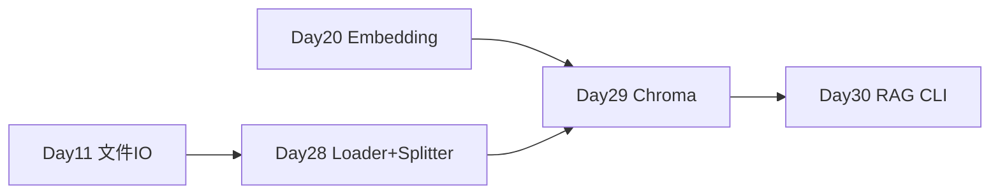

# Day 28 · Document Loader 与 Text Splitter · RAG 文档链

> **旁白（讲师口吻）**  
> 周一早会，刘姐把 200+ 份制度文档清单投屏：*「Day 11 你们会扫目录数关键词了，今天上 **LangChain Document Loader**——PDF、Word、Markdown、网页、CSV 统一读进来；下午 **Text Splitter** 切块，`chunk_size` 别拍脑袋。」*  
> 张工补充：*「切块结果明天 Day 29 进 Chroma；今天先把 **load → split** 跑稳。」*

---

## 今日学习地图

| 时段 | 主题 | 产出物 |
|------|------|--------|
| 09:00–10:30 | Document Loader：PDF/Word/MD/Web/CSV | `doc_loader_demo.py` |
| 10:30–12:00 | Text Splitter：Character vs Recursive | `text_splitter_demo.py` |
| 14:00–15:30 | chunk_size / overlap 调参实验 | `output/splitter_tuning_report.json` |
| 15:30–16:30 | PDF 电子书处理流水线 | `process_pdf_ebook.py` |
| 16:30–17:30 | 与 Day 11 样本库对齐验收 | `run.sh` |
| 19:00–21:00 | 作业 + Git commit | `06_课后作业.md` |

## 与前后课程的衔接



| 前序能力 | 今日升级 |
|----------|----------|
| Day 11 `iter_text_files` | LangChain `DocumentLoader` 统一接口 |
| Day 15 Token 计量 | chunk_size 与成本、召回权衡 |
| Day 20 Embedding 概念 | 切块质量影响向量检索 |

## 今日文件清单

| 文件 | 用途 |
|------|------|
| [01_业务背景.md](./01_业务背景.md) | 知识库批量入库需求 |
| [02_需求文档.md](./02_需求文档.md) | Loader + Splitter PRD |
| [03_架构与设计.md](./03_架构与设计.md) | 文档链架构 |
| [04_课堂讲义.md](./04_课堂讲义.md) | **主课** |
| [05_流程图与示意图.md](./05_流程图与示意图.md) | load→split 流程图 |
| [06_课后作业.md](./06_课后作业.md) | 必做 / 选做 |
| [07_作业参考答案.md](./07_作业参考答案.md) | 参考答案 |
| [08_补充讲义_Loader与切块进阶.md](./08_补充讲义_Loader与切块进阶.md) | 编码、metadata、生产注意 |
| [code/doc_loader_demo.py](./code/doc_loader_demo.py) | **多格式 Loader 演示** |
| [code/text_splitter_demo.py](./code/text_splitter_demo.py) | **Splitter 对比与调参** |
| [code/process_pdf_ebook.py](./code/process_pdf_ebook.py) | PDF 切块导出 |
| [code/data/sample_docs/](./code/data/sample_docs/) | 样本知识库 |
| [run.sh](./run.sh) | 一键演示 |

## 今日验收标准

- [ ] 能口述 `Document` 的 `page_content` 与 `metadata`  
- [ ] `doc_loader_demo.py` 六种格式全部 `[OK]`  
- [ ] 能解释 Character vs Recursive 切分差异  
- [ ] 完成 chunk_size 100/200/400/800 对比实验  
- [ ] `process_pdf_ebook.py` 导出 JSON 切块清单  
- [ ] `bash run.sh` 无 API Key 可完整跑通  
- [ ] Git commit message 含 `day28`

## 快速开始

```bash
cd day28
bash run.sh
```

或：

```bash
cd day28/code
pip install -r requirements.txt
python3 doc_loader_demo.py
python3 text_splitter_demo.py
python3 process_pdf_ebook.py
```

---

**讲师提醒**：今日 **不切向量、不调大模型**——专注「读进来、切整齐」。明天 Day 29 把这些块 embed 进 Chroma。

**状态**：✅ Day 28 完整课件已发布
