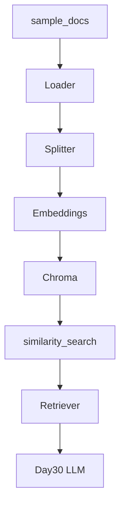
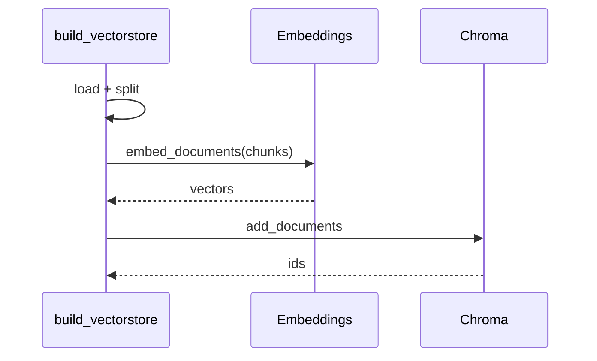

# Day 29 流程图与示意图



## 建库时序



## 检索时序

```text
query ──embed_query──▶ q_vec
                          │
chroma collection ◀───────┘
                          │
                    top-k by distance
                          │
                          ▼
                    list[Document]
```

---

*Day 29 图示 v1.0*
