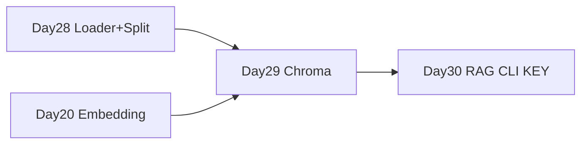

# Day 29 · Chroma 向量库 · Embedding 与 Retriever

> **旁白（讲师口吻）**  
> 周二早上，刘姐指着 Day 28 导出的切块 JSON：*「块切好了，今天 **embed 进 Chroma**，我要能用『退款』搜到 FAQ。」*  
> 张工在白板上写：*「`build_vectorstore.py` 一条命令建库；`similarity_search_demo.py` 验召回；没 Key 就 mock 向量。」*

---

## 今日学习地图

| 时段 | 主题 | 产出物 |
|------|------|--------|
| 09:00–10:30 | Embedding 接入 LangChain | `mock_embeddings.py` |
| 10:30–12:00 | Chroma 持久化与集合 | `chroma_kb.py` |
| 14:00–15:30 | 从 Day 28 样本建库 | `build_vectorstore.py` |
| 15:30–16:30 | 相似检索与 Retriever | `similarity_search_demo.py` |
| 16:30–17:30 | `verify_day29.py` 验收 | 全绿 |
| 19:00–21:00 | 作业 | `06_课后作业.md` |

## 与前后课程的衔接



## 今日文件清单

| 文件 | 用途 |
|------|------|
| [01_业务背景.md](./01_业务背景.md) | 向量库入库需求 |
| [02_需求文档.md](./02_需求文档.md) | Chroma PRD |
| [03_架构与设计.md](./03_架构与设计.md) | embed + store + retrieve |
| [04_课堂讲义.md](./04_课堂讲义.md) | **主课** |
| [05_流程图与示意图.md](./05_流程图与示意图.md) | 向量检索流程 |
| [06_课后作业.md](./06_课后作业.md) | 必做 / 选做 |
| [07_作业参考答案.md](./07_作业参考答案.md) | 参考答案 |
| [08_补充讲义_Chroma与检索进阶.md](./08_补充讲义_Chroma与检索进阶.md) | 过滤、MRR、生产 |
| [code/chroma_kb.py](./code/chroma_kb.py) | **Chroma 封装** |
| [code/build_vectorstore.py](./code/build_vectorstore.py) | **建库脚本** |
| [code/similarity_search_demo.py](./code/similarity_search_demo.py) | 检索演示 |
| [code/verify_day29.py](./code/verify_day29.py) | 验收 |

## 今日验收标准

- [ ] 理解 Chroma `persist_directory` 持久化  
- [ ] mock embedding 无 Key 可建库检索  
- [ ] `build_vectorstore.py` chunks ≥ 5  
- [ ] 「如何申请退款」Top-3 含退款相关块  
- [ ] `as_retriever()` 可 invoke  
- [ ] `python3 verify_day29.py` 全部 `[OK]`  

## 快速开始

```bash
cd day29
bash run.sh
```

---

**讲师提醒**：今日 **不调 LLM 生成**——专注「搜得准」。明天 Day 30 KEY DAY 串完整 RAG。

**状态**：✅ Day 29 完整课件已发布
