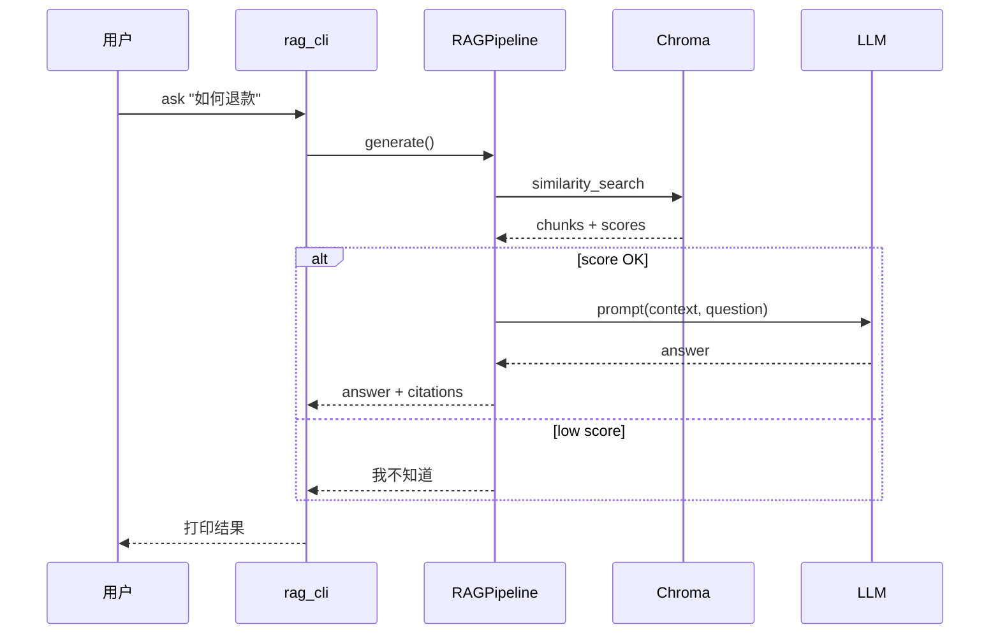

# Day 30 流程图与示意图

## RAG 全链路



## unknown 决策

```text
        retrieve
            │
            ▼
      chunks 为空? ──是──▶ UNKNOWN
            │否
            ▼
   max(score) < threshold? ──是──▶ UNKNOWN
            │否
            ▼
   无关关键词且无上下文? ──是──▶ UNKNOWN
            │否
            ▼
        generate
```

---

*Day 30 KEY DAY 图示*
