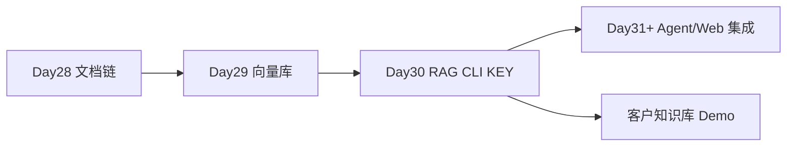

# Day 30 · 完整 RAG 流水线 CLI · KEY DAY

> **旁白（讲师口吻）**  
> 周三下午，小陈在会议室宣布：*「客户下周要 **知识库问答 Demo**——不是搜文档列表，是要 **带引用的一句话答案**；搜不到就说 **我不知道**。」*  
> 张工：*「Day 30 是 Week 5 **KEY DAY**：`rag_cli.py` 一条命令 **load→split→embed→store→retrieve→generate**，今天必须全绿。」*

---

## 今日学习地图

| 时段 | 主题 | 产出物 |
|------|------|--------|
| 09:00–10:30 | RAG 架构回顾与 Prompt 设计 | `prompts/rag_prompt.txt` |
| 10:30–12:00 | `rag_pipeline.py` 六阶段实现 | ingest / retrieve / generate |
| 14:00–15:30 | 引用溯源与 unknown 兜底 | `RAG_SCORE_THRESHOLD` |
| 15:30–16:30 | `rag_cli.py`：ingest / ask / chat | CLI 演示 |
| 16:30–17:30 | `verify_day30.py` KEY 验收 | 全链路 |
| 19:00–21:00 | 作业 + 答辩彩排 | `06_课后作业.md` |

## 里程碑定位



## 今日文件清单

| 文件 | 用途 |
|------|------|
| [01_业务背景.md](./01_业务背景.md) | 客户知识库 Demo |
| [02_需求文档.md](./02_需求文档.md) | RAG CLI PRD |
| [03_架构与设计.md](./03_架构与设计.md) | 六阶段数据流 |
| [04_课堂讲义.md](./04_课堂讲义.md) | **主课** |
| [05_流程图与示意图.md](./05_流程图与示意图.md) | RAG 时序图 |
| [06_课后作业.md](./06_课后作业.md) | 评测集 / 阈值调优 |
| [07_作业参考答案.md](./07_作业参考答案.md) | 参考答案 |
| [08_补充讲义_RAG评测与防幻觉.md](./08_补充讲义_RAG评测与防幻觉.md) | 幻觉、重排、安全 |
| [code/rag_pipeline.py](./code/rag_pipeline.py) | **核心流水线** |
| [code/rag_cli.py](./code/rag_cli.py) | **CLI 入口** |
| [code/prompts/rag_prompt.txt](./code/prompts/rag_prompt.txt) | RAG Prompt |
| [code/verify_day30.py](./code/verify_day30.py) | KEY 验收 |

## 今日验收标准

- [ ] `rag_cli.py ingest` 成功建库  
- [ ] 「如何申请退款？」返回答案 **含引用**  
- [ ] 无关问题返回 **「我不知道。建议联系人工客服…」**  
- [ ] `verify_day30.py` 全部 `[OK]`  
- [ ] 能口述 RAG 六阶段  
- [ ] Git commit message 含 `day30`  

## 快速开始

```bash
cd day30
bash run.sh
```

```bash
cd day30/code
python3 rag_cli.py ask "如何申请退款？" --mock --rebuild
python3 rag_cli.py chat --mock
```

---

**讲师提醒**：KEY DAY 签收标准——**有引用、能拒答、CLI 可演示**。mock 模式必须与客户彩排同等流畅。

**状态**：✅ Day 30 完整 RAG CLI 课件已发布
