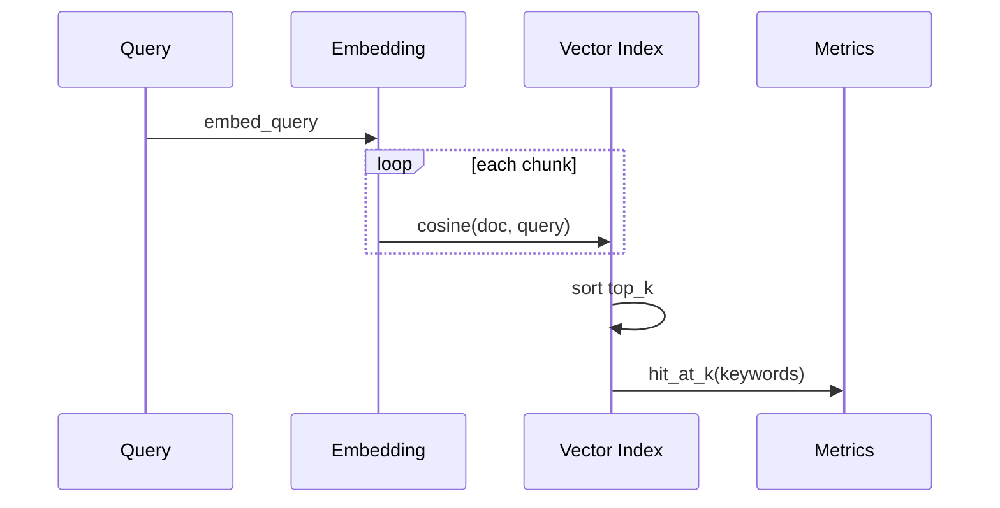

# Day 31 架构与设计 · RAG 调参实验矩阵

## 1. 系统上下文

```text
  sparktech_kb.txt
        │
        ▼
  RecursiveCharacterTextSplitter (chunk_size × overlap)
        │
        ▼
  EmbeddingModel (mock / OpenAI)
        │
        ▼
  Vector Search (cosine, top_k)
        │
        ▼
  hit_rate 评估 (EVAL_QUERIES)
        │
        ▼
  output/rag_tuning_*.json
```

## 2. 实验矩阵

| 轴 | 级别数 | 教学关注点 |
|----|--------|------------|
| chunk_size | 3 | 粒度 vs 完整性 |
| top_k | 3 | 召回 vs 噪声 |
| embedding | 3 | 中英文语义空间差异 |

总组合：3 × 3 × 3 = **27 组**（mock 可快速跑完）

## 3. 模块职责

| 模块 | 文件 | 职责 |
|------|------|------|
| 语料 | `data/sparktech_kb.txt` | 固定评测基准 |
| 工具 | `rag_common.py` | mock embed、RRF、hit@k |
| 实验台 | `rag_tuning_lab.py` | 网格搜索 + 报告 |
| 验收 | `verify_day31.py` | 单元 + 集成检查 |

## 4. 调参决策树（讲师用）

```text
召回率低？
  ├─ 是 → 减小 chunk_size 或增大 top_k 或换 embedding
  └─ 否 → 生成幻觉多？
         ├─ 是 → 减小 top_k，加 rerank（Day 33）
         └─ 否 → 维持配置，监控 latency
```

## 5. LangChain 集成点

```python
from langchain_text_splitters import RecursiveCharacterTextSplitter
from langchain_core.documents import Document

splitter = RecursiveCharacterTextSplitter(
    chunk_size=512,
    chunk_overlap=64,
    separators=["\n\n", "\n", "。", "；", " ", ""],
)
docs = splitter.create_documents([corpus])
```

## 6. 数据流（单条查询）



## 7. 扩展点（作业）

- 增加 `chunk_overlap` 作为第四维  
- 接入 Chroma 持久化索引对比内存检索  
- 绘制 hit_rate 热力图（matplotlib 选做）
