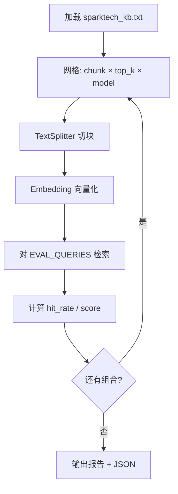
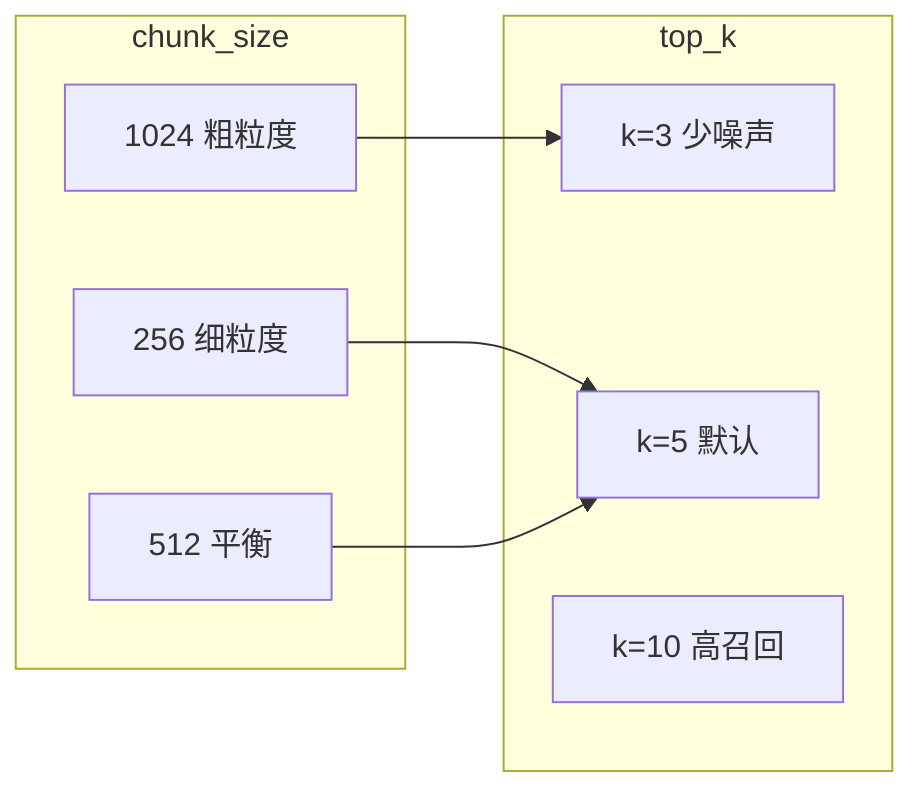

# Day 31 流程图与示意图

## 1. 调参实验总流程



## 2. 检索单链路

```ascii
  User Query: "怎么申请 API Key？"
        │
        ▼
  ┌─────────────┐
  │ embed_query │
  └──────┬──────┘
         │
         ▼
  ┌──────────────────────────────┐
  │  For each chunk: cosine sim  │
  └──────────────┬───────────────┘
                 │
                 ▼
  ┌──────────────────────────────┐
  │  Sort desc → take top_k      │
  └──────────────┬───────────────┘
                 │
                 ▼
  hit_at_k?  keywords in top_k chunks
```

## 3. 参数影响示意



## 4. Week 4 → Day 31 位置

```text
  Day 25 ── Day 26 ── Day 27 ── Day 28 ── Day 29 ── Day 30
                                                      │
                                                      ▼
                                              Day 31 测验+调参
                                                      │
                                    ┌─────────────────┴─────────────────┐
                                    ▼                                   ▼
                              Day 32 高级 RAG                    Day 33 Hybrid
```
