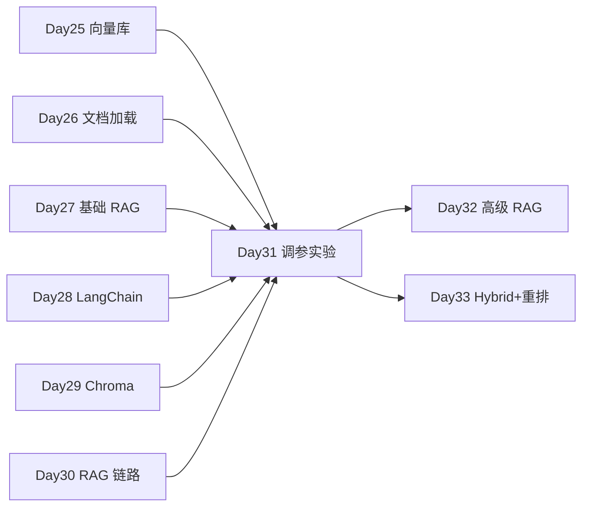

# Day 31 · Week 4 阶段测验 · RAG 调参实验（chunk / top_k / embedding）

> **旁白（讲师口吻）**  
> 周五上午，李姐在群里发了一行字：*「Week 4 结业考不是选择题——上午 `week4_review_quiz` 检验 RAG 基础；下午跑 `rag_tuning_lab.py`，把 chunk_size、top_k、embedding 模型三组参数扫一遍，提交最佳配置截图。」*  
> 张工补充：*「QA 要的是可复现指标，不是凭感觉调参。mock 模式先闭环，有 Key 的同学可切 live 对比。」*

---

## 今日学习地图

| 时段 | 主题 | 产出物 |
|------|------|--------|
| 09:00–10:00 | Week 4 知识回顾测验 | `code/week4_review_quiz.md` |
| 10:00–10:30 | 测验讲评 & RAG 薄弱点梳理 | 讲师白板 |
| 10:30–12:00 | chunk / top_k / embedding 原理 | `03_架构与设计.md` |
| 14:00–16:30 | **主实战**：`rag_tuning_lab.py` | 网格搜索实验报告 |
| 16:30–17:00 | `verify_day31.py` 验收 | 全绿截图 |
| 17:00–17:30 | Week 4 复盘 & Day 32 预习 | `06_课后作业.md` |
| 19:00–21:00 | 错题订正 / 选做扩展 | `homework/day31/` |

## 与前后课程的衔接



| 前序能力 | 今日综合用法 |
|----------|--------------|
| Day 20 Embedding / cosine | mock 向量与模型对比 |
| Day 27–30 RAG 链路 | 调参实验台网格搜索 |
| Day 17 Prompt Context | 检索片段拼入生成 Prompt |
| LangChain TextSplitter | `RecursiveCharacterTextSplitter` |

## 今日文件清单

| 文件 | 用途 |
|------|------|
| [01_业务背景.md](./01_业务背景.md) | Week 4 结业考与调参背景 |
| [02_需求文档.md](./02_需求文档.md) | RAG 调参实验 PRD |
| [03_架构与设计.md](./03_架构与设计.md) | 实验矩阵、指标设计 |
| [04_课堂讲义.md](./04_课堂讲义.md) | **主课**（测验 + 调参实验） |
| [05_流程图与示意图.md](./05_流程图与示意图.md) | 调参流程、检索时序 |
| [06_课后作业.md](./06_课后作业.md) | 错题订正 + 扩展作业 |
| [07_作业参考答案.md](./07_作业参考答案.md) | 测验答案与讲评 |
| [08_补充讲义_RAG调参速查.md](./08_补充讲义_RAG调参速查.md) | 参数速查表 |
| [code/week4_review_quiz.md](./code/week4_review_quiz.md) | **Week 4 测验题** |
| [code/rag_tuning_lab.py](./code/rag_tuning_lab.py) | **调参实验主程序** |
| [code/rag_common.py](./code/rag_common.py) | 共享 mock / 工具 |
| [code/verify_day31.py](./code/verify_day31.py) | 自动化验收 |
| [code/data/sparktech_kb.txt](./code/data/sparktech_kb.txt) | 教学语料 |
| [run.sh](./run.sh) | 一键运行实验 |

## 今日验收标准

- [ ] 完成 `week4_review_quiz.md` 测验，正确率 ≥ 80%  
- [ ] 理解 chunk_size / top_k / embedding 对召回的影响  
- [ ] `rag_tuning_lab.py` 输出实验报告与 JSON 结果  
- [ ] 能解释推荐配置的选择依据（hit_rate + score）  
- [ ] 无 API Key 时 `python3 verify_day31.py` 全部 `[OK]`  
- [ ] Git commit message 含 `day31`

## 快速开始

```bash
cd day31
bash run.sh                    # 创建 venv、安装依赖、运行实验
# 或
cd day31/code
pip install -r requirements.txt
cp .env.example .env           # 可选
python3 rag_tuning_lab.py
python3 verify_day31.py
```

---

**讲师提醒**：调参不是玄学——固定评测集、固定指标、网格搜索，再谈「最佳配置」。mock embedding 教学可跑，生产请换真实模型。

**状态**：✅ Day 31 Week 4 测验 + RAG 调参完整课件已发布
