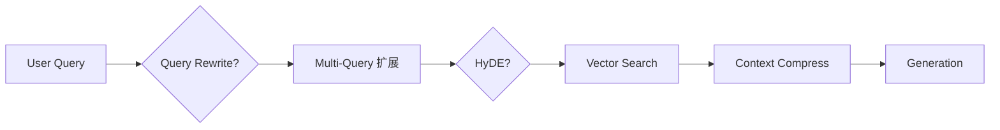

# Day 32 架构与设计 · 检索前处理链

## 1. 管道架构

## 2. 技术选型

| 技术 | 成本 | 收益 |
|------|------|------|
| Rewrite | 1 次 LLM | 对齐文档措辞 |
| Multi-Query | N 次检索 | 提高召回 |
| HyDE | 1 次 LLM + 检索 | 问句→答案空间对齐 |
| Compress | 无模型 | 控制 token |

## 3. LangChain 对应概念

- `MultiQueryRetriever`（langchain）— 今日手写教学版  
- `HypotheticalDocumentEmbedder` — 对应 HyDE 思路  
- `ContextualCompressionRetriever` — 压缩扩展阅读

## 4. mock 策略

规则模板保证 CI 稳定；live 模式可选 OpenAI 改写/生成。
