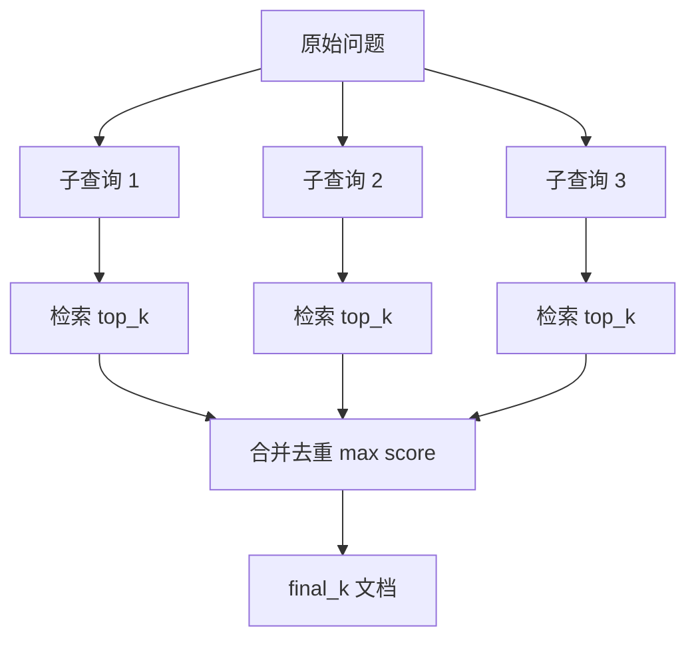

# Day 32 流程图与示意图

## Multi-Query 流程



## HyDE 流程

```ascii
  Query: "能退钱吗"
        │
        ▼
  LLM 生成假设文档:
  "用户可在7天内申请退款..."
        │
        ▼
  embed(假设文档) ──cosine──► 真实 chunks
        │
        ▼
  top_k 真实文档 → LLM
```

## 技术对比

| 方法 | 额外 LLM 调用 | 适合场景 |
|------|---------------|----------|
| Rewrite | 1 | 口语/错别字 |
| Multi-Query | 0~1 | 多角度召回 |
| HyDE | 1 | 短问句、答案型 KB |
