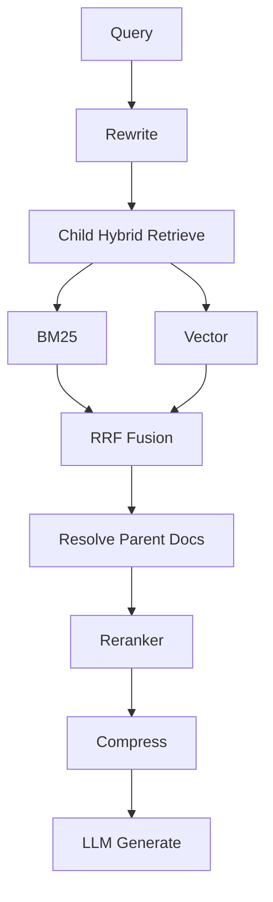

# Day 33 架构与设计 · 增强 RAG 全链路

## 1. 管道架构



## 2. RRF 公式

\[
\text{RRF}(d) = \sum_i \frac{1}{k + \text{rank}_i(d)}
\]

默认 `k=60`。分数无需归一化，适合 BM25 与 cosine 混合。

## 3. Parent Document 模式

| 层级 | chunk_size | 用途 |
|------|------------|------|
| Child | ~180 | 精细检索 |
| Parent | 整章节 | 完整上下文生成 |

metadata：`parent_id`, `child_id`, `title`

## 4. Rerank 位置

在 **融合后、生成前** 对 parent 级文档重排，控制 cross-encoder 调用次数。

## 5. 模块依赖

```text
rag_common.py      → 工具函数
hybrid_retriever   → BM25 + Vector + RRF
rerank_demo        → MockBGEReranker
enhanced_rag_pipeline → 编排
```
