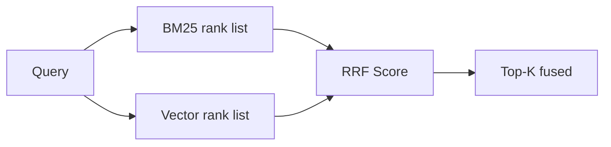
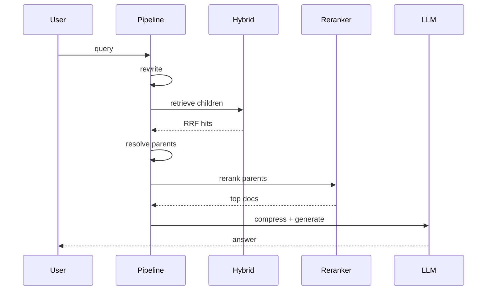

# Day 33 流程图与示意图

## Hybrid + RRF



## Parent Document

```ascii
  Parent: ## 退款政策 (完整章节)
      ├── child-0  (小块) ──检索命中──┐
      ├── child-1                   │
      └── child-2                   │
                                    ▼
                          返回 Parent 全文给 LLM
```

## 全链路时序


