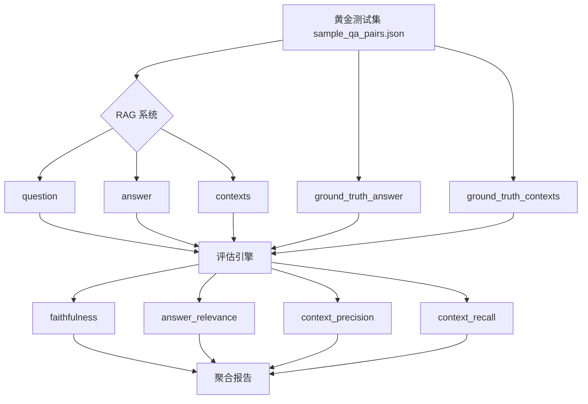
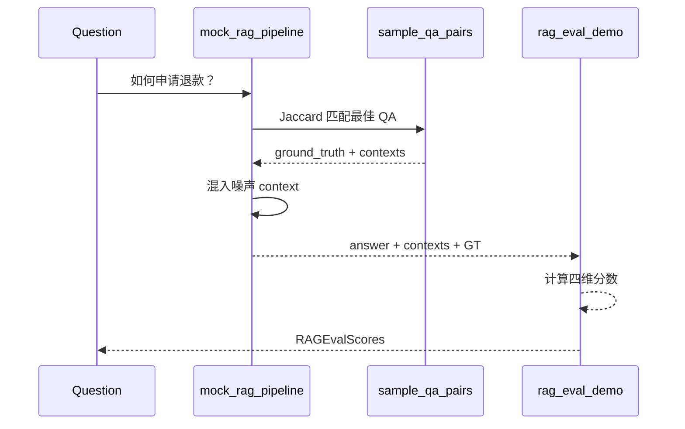

# Day 34 流程图与示意图

## 1. RAG 评估总流程



## 2. mock_rag_pipeline 时序



## 3. 四维指标关系（ASCII）

```text
                    ┌──────────────┐
                    │   Question   │
                    └──────┬───────┘
                           │
           ┌───────────────┼───────────────┐
           ▼               ▼               ▼
    ┌────────────┐  ┌────────────┐  ┌────────────┐
    │ Retriever  │  │  Contexts  │  │   Answer   │
    └─────┬──────┘  └─────┬──────┘  └─────┬──────┘
          │               │               │
          │         context_precision     │
          │         context_recall        │
          │               │               │
          │               └───────┬───────┘
          │                       │
          │                 faithfulness
          │                       │
          └───────────────────────┴── answer_relevance
```

## 4. Ragas 回退决策树

```text
  ragas_eval.py 启动
        │
        ├─ ragas 已安装？
        │     ├─ 否 → mock_heuristic
        │     └─ 是 → 调用 evaluate()
        │              ├─ 成功 → ragas 分数
        │              └─ 异常 → mock_fallback
        │
        └─ --force-mock → mock_heuristic
```

## 5. build_test_set 数据流

```text
  data/kb_*.md
       │ parse_markdown_sections (##)
       ▼
  section_to_question + extract_answer
       │
       ▼
  merge_pairs(seed, generated)
       │
       ▼
  validate_pairs → sample_qa_pairs.json
```

---

**状态**：✅ 可直接贴入答辩 PPT
