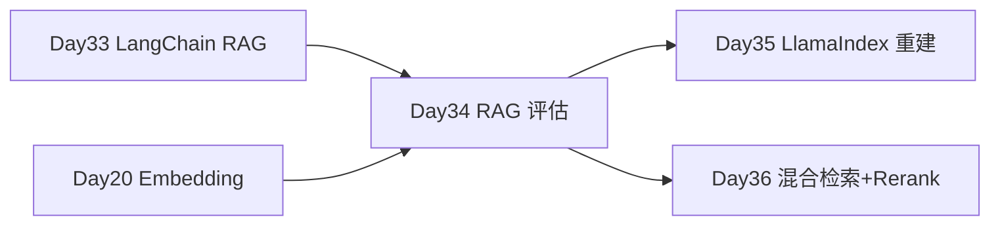

# Day 34 · RAG 评估 · Faithfulness / Relevance / Context 指标与 Ragas

> **旁白（讲师口吻）**  
> 周一质量复盘会，客服主管甩出一张 Excel：*「Day 33 LangChain 知识库上线了，但用户说机器人『胡说八道』——你们怎么证明 RAG **不是拍脑袋**？」*  
> 张工在白板上写了四个词：**faithfulness、relevance、context precision、context recall**，然后说：*「Day 34 不上新功能，先建 **评估集 + 跑分脚本**。有 Ragas 用 Ragas；没装就用我们的 mock。下午 QA 要一份可复现的评估报告。」*

---

## 今日学习地图

| 时段 | 主题 | 产出物 |
|------|------|--------|
| 09:00–10:30 | RAG 评估为什么重要、四大指标含义 | `04_课堂讲义.md` 第一章 |
| 10:30–12:00 | 手工启发式评估 `rag_eval_demo.py` | faithfulness / relevance 实现 |
| 14:00–15:00 | 构建黄金测试集 `build_test_set.py` | `sample_qa_pairs.json` |
| 15:00–16:30 | Ragas 框架与 `ragas_eval.py`（mock 回退） | 聚合评估报告 |
| 16:30–17:00 | `verify_day34.py` 验收 | 全绿截图 |
| 19:00–21:00 | 作业：扩展评估集 + 对比 Day 33 回答 | `06_课后作业.md` |

## 与前后课程的衔接



| 前序能力 | 今日升级 |
|----------|----------|
| Day 33 RAG 问答链 | 对同一问题产出可量化分数 |
| Day 20 相似度思想 | 教学版 Jaccard 近似 relevance |
| Day 11 文档切块 | `build_test_set.py` 从 Markdown 抽 QA |

## 今日文件清单

| 文件 | 用途 |
|------|------|
| [01_业务背景.md](./01_业务背景.md) | 质量复盘会与评估需求 |
| [02_需求文档.md](./02_需求文档.md) | RAG 评估 PRD |
| [03_架构与设计.md](./03_架构与设计.md) | 评估流水线架构 |
| [04_课堂讲义.md](./04_课堂讲义.md) | **主课** 四大指标 + Ragas |
| [05_流程图与示意图.md](./05_流程图与示意图.md) | 评估时序与数据流 |
| [06_课后作业.md](./06_课后作业.md) | 必做 / 选做 / 挑战 |
| [07_作业参考答案.md](./07_作业参考答案.md) | 参考答案 |
| [08_补充讲义_Ragas评估指标深入.md](./08_补充讲义_Ragas评估指标深入.md) | Ragas 指标与 LLM-as-judge |
| [code/rag_eval_demo.py](./code/rag_eval_demo.py) | **启发式四指标演示** |
| [code/build_test_set.py](./code/build_test_set.py) | 测试集构建 |
| [code/ragas_eval.py](./code/ragas_eval.py) | Ragas / mock 评估 |
| [code/sample_qa_pairs.json](./code/sample_qa_pairs.json) | 黄金 QA 与标准上下文 |
| [code/verify_day34.py](./code/verify_day34.py) | 自动化验收 |
| [run.sh](./run.sh) | 一键演示 |

## 今日验收标准

- [ ] 能口述 faithfulness / answer relevance / context precision / context recall 含义  
- [ ] `rag_eval_demo.py` 对「如何申请退款？」输出四维分数  
- [ ] `build_test_set.py` 从 `data/*.md` 生成 ≥10 条 QA  
- [ ] `ragas_eval.py --force-mock` 输出聚合指标  
- [ ] 理解 Ragas 未安装时 mock 回退策略  
- [ ] `python3 verify_day34.py` 全部 `[OK]`  
- [ ] Git commit message 含 `day34`

## 快速开始

```bash
cd day34
bash run.sh
# 或
cd day34/code
pip install -r requirements.txt
python3 build_test_set.py
python3 rag_eval_demo.py
python3 ragas_eval.py --force-mock
python3 verify_day34.py
```

---

**讲师提醒**：评估不是为了好看的分，是为了 **改检索、改 Prompt、改切块** 时有据可依。今日 mock 指标是教学近似；生产请用 Ragas + 真实 LLM judge。

**状态**：✅ Day 34 RAG 评估完整课件已发布
