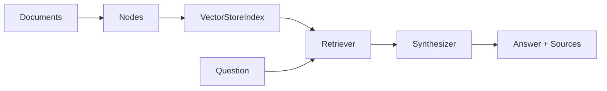
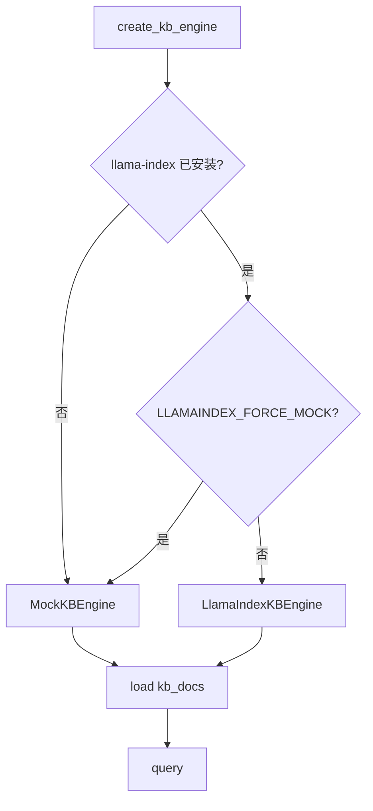
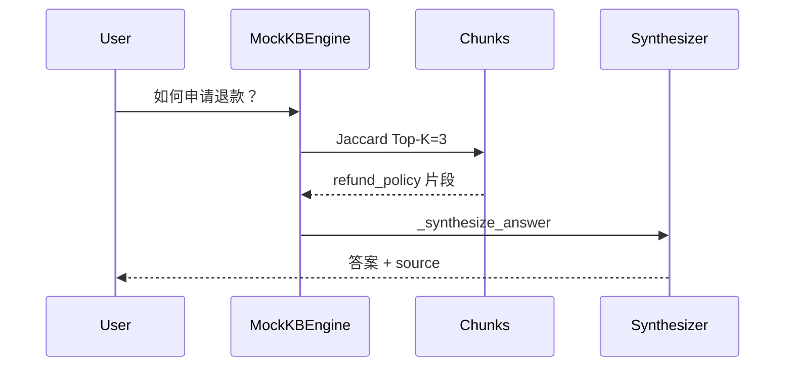

# Day 35 流程图与示意图

## 1. LlamaIndex 核心数据流



## 2. 双引擎选择



## 3. LangChain vs LlamaIndex 对照（ASCII）

```text
  LangChain (Day 33)                 LlamaIndex (Day 35)
  ─────────────────                  ───────────────────
  DirectoryLoader                    SimpleDirectoryReader
         │                                    │
         ▼                                    ▼
  TextSplitter                       SentenceSplitter / ##切分
         │                                    │
         ▼                                    ▼
  Chroma / FAISS                     VectorStoreIndex
         │                                    │
         ▼                                    ▼
  RetrievalQA / LCEL                 QueryEngine
         │                                    │
         └────────────┬───────────────────────┘
                      ▼
              Day 34 统一评估
```

## 4. 查询时序（mock 模式）



## 5. 与 Day 34 评估衔接

```text
  llamaindex_kb.query()
         │
         ▼
  QueryResult (answer, chunks)
         │
         ▼
  RAGEvalInput + sample_qa_pairs GT
         │
         ▼
  evaluate_rag_sample() → 四维分数
```

---

**状态**：✅ 可直接贴入答辩 PPT
